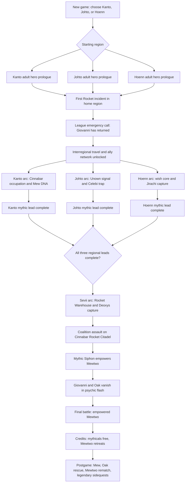
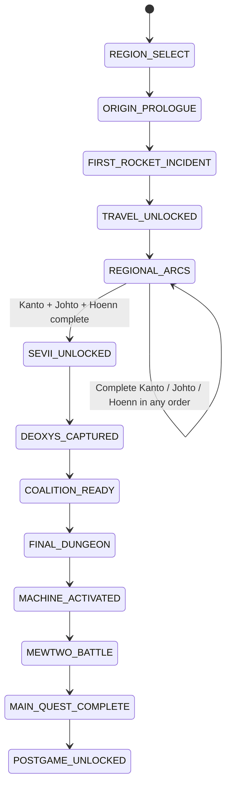
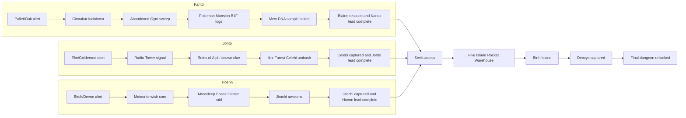
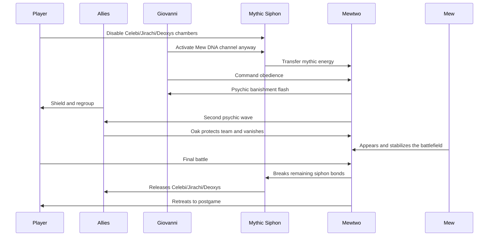

# Pokemon Omnis Main Story Timeline

This is the source-of-truth planning file for the main quest. Update this file first when the story changes, then update scripts, maps, flags, dialogue, trainers, and cutscenes to match it.

The visual sections use Mermaid diagrams inside Markdown. They render in GitHub and many Markdown previewers, while still staying readable as plain text.

## Canon For v0.1

- The player chooses Kanto, Johto, or Hoenn during the new-game intro. The repo already stores this as `gSaveBlock2Ptr->playerRegion` and exposes it to scripts through `checkplayerregion`.
- The chosen region determines the player identity: Red or Leaf for Kanto, Ethan or Kris for Johto, Brendan or May for Hoenn. If implementation uses a Lyra-labeled sprite internally, treat it as the Johto female protagonist slot for this story. The unchosen regional heroes appear as older NPC allies.
- All original main characters are adults with their own homes, jobs, and histories. They are not starting as children living with parents.
- Giovanni has returned and leads Team Rocket again. His hidden project is a created Mewtwo powered by a Mythic Siphon machine.
- The machine needs four mythic inputs: Mew, Celebi, Jirachi, and Deoxys.
- Mew is not physically captured in the main quest. Giovanni uses Mew DNA and mansion research recovered from Cinnabar Island as the Kanto input. This keeps Mew unique and reserves it as a postgame reward.
- Celebi, Jirachi, and Deoxys are captured during the Johto, Hoenn, and Sevii arcs.
- Cinnabar Island is occupied by Team Rocket. Blaine has been forced out. The Cinnabar Gym becomes an abandoned Rocket-occupied battle dungeon and does not award a badge.
- The main climax happens under Cinnabar Island, in a Rocket citadel built into the Pokemon Mansion basement/lab ruins.
- At the climax, the machine empowers Mewtwo. Mewtwo immediately rejects Giovanni and banishes him in a psychic flash. The player does not know whether Giovanni died.
- Professor Oak is also banished while shielding the player and the allied heroes. This gives the climax a personal cost and gives the postgame Mew event a concrete purpose.
- The player defeats the empowered Mewtwo, but does not catch it in the main quest. Mewtwo retreats after regaining control. Cerulean Cave becomes its postgame rematch/capture location.
- After credits, Faraway Island unlocks. Mew appears there as the reward for completing the main quest and as the key to finding/rescuing Oak.

## Existing Repo Hooks

Use these existing hooks before adding new systems:

| Need | Existing hook |
| --- | --- |
| Region choice | `src/main_menu.c` already has Kanto/Johto/Hoenn selection. |
| Region checks in scripts | `checkplayerregion` sets `VAR_RESULT` to `KANTO`, `JOHTO`, or `HOENN`. |
| First warp by region | `data/maps/InsideOfTruck/scripts.inc` already routes to Pallet, New Bark, or Littleroot. |
| Player sprites by region | `src/main_menu.c`, `src/field_player_avatar.c`, and battle controllers already branch by `playerRegion`. |
| Mythic overworld sprites | `OBJ_EVENT_GFX_MEW`, `OBJ_EVENT_GFX_CELEBI`, `OBJ_EVENT_GFX_MEWTWO`, `OBJ_EVENT_GFX_JIRACHI`, `OBJ_EVENT_GFX_DEOXYS`. |
| Existing mythic event flags | `FLAG_HIDE_MEW`, `FLAG_HIDE_ILEX_FOREST_CELEBI`, `FLAG_HIDE_DEOXYS`, `FLAG_HIDE_BIRTH_ISLAND_DEOXYS_TRIANGLE`, `FLAG_CAUGHT_MEW`, `FLAG_CAUGHT_OR_DEFEATED_CELEBI`, `FLAG_DEFEATED_DEOXYS`. |
| Core maps already present | Cinnabar, Pokemon Mansion, Ruins of Alph, Ilex Forest, Mossdeep Space Center, Five Island Rocket Warehouse, Birth Island, Faraway Island, Cerulean Cave. |

Do not use player-caught flags for Team Rocket story captures. Story capture needs separate `OMNIS` flags so the Pokedex, postgame encounters, and event rewards stay clean.

## Visual Main Timeline

## Main Quest State Machine

## Regional Arc Dependencies

## Cast Matrix

| Group | Characters | Main role |
| --- | --- | --- |
| Player identity | Red/Leaf, Ethan/Kris, Brendan/May depending region and gender | The selected adult hero. Starts with a fresh investigation team for gameplay balance. |
| Kanto allies | Unselected Red/Leaf, Blue, Oak, Blaine, possibly Mr. Fuji | Expose the Cinnabar origin of Mewtwo and the Mew DNA input. |
| Johto allies | Unselected Ethan/Kris, Silver, Elm, Kurt, Kimono Girls | Decode the Unown signal and fail to stop Celebi's capture. |
| Hoenn allies | Unselected Brendan/May, Wally, Birch, Steven, Devon scientists, Mossdeep staff | Trace the wish-energy core and fail to stop Jirachi's capture. |
| Sevii allies | Celio, Lorelei, Rocket informant/admin turncoat if needed | Trace Rocket shipping routes and Birth Island coordinates. |
| Villains | Giovanni, Rocket admins, Rocket scientists, Rocket grunts | Rebuild Team Rocket around mythic-energy extraction instead of simple crime. |
| Mythics | Mew, Celebi, Jirachi, Deoxys, Mewtwo | Mew stays free. Celebi/Jirachi/Deoxys are captured. Mewtwo becomes the false vessel and final threat. |

## Story Variables To Add

Prefer a small number of vars and many named flags. Assign exact IDs during implementation after checking `include/constants/vars.h`.

| Var | Values | Purpose |
| --- | --- | --- |
| `VAR_OMNIS_MAIN_STORY` | `0, 10, 20...120` | Main quest global phase. |
| `VAR_OMNIS_KANTO_ARC` | `0, 10, 20...100` | Kanto story progress. |
| `VAR_OMNIS_JOHTO_ARC` | `0, 10, 20...100` | Johto story progress. |
| `VAR_OMNIS_HOENN_ARC` | `0, 10, 20...100` | Hoenn story progress. |
| `VAR_OMNIS_SEVII_ARC` | `0, 10, 20...100` | Sevii story progress. |
| `VAR_OMNIS_FINAL_DUNGEON` | `0, 10, 20...100` | Cinnabar Rocket Citadel progress. |
| `VAR_OMNIS_ACTIVE_ALLY` | enum | Which major ally should appear in shared cutscenes. |
| `VAR_OMNIS_PROFESSOR_STATE` | enum | Oak present, Oak banished, Oak rescued. |

Suggested `VAR_OMNIS_MAIN_STORY` values:

| Value | Meaning |
| --- | --- |
| `0` | New game / not initialized. |
| `10` | Region chosen and adult-home prologue active. |
| `20` | First home-region Rocket incident complete. |
| `30` | Interregional travel unlocked. |
| `40` | Regional mythic arcs active. |
| `50` | Kanto, Johto, and Hoenn arcs complete. |
| `60` | Sevii arc unlocked. |
| `70` | Deoxys captured by Rocket. |
| `80` | Coalition assault ready. |
| `90` | Final dungeon entered. |
| `100` | Mythic Siphon activated; Giovanni and Oak banished. |
| `110` | Mewtwo defeated. |
| `120` | Main quest complete; postgame unlocked. |

## Story Flags To Add

Use `FLAG_OMNIS_` for permanent story flags and `FLAG_HIDE_OMNIS_` for object visibility. Exact numeric allocation is intentionally deferred.

### Core Flags

| Flag | Set when |
| --- | --- |
| `FLAG_OMNIS_REGION_CHOICE_COMPLETE` | New-game region choice is locked in. |
| `FLAG_OMNIS_ORIGIN_PROLOGUE_COMPLETE` | The selected region's adult-home intro is complete. |
| `FLAG_OMNIS_FIRST_ROCKET_INCIDENT_COMPLETE` | The player's first local Rocket incident is complete. |
| `FLAG_OMNIS_INTERREGIONAL_TRAVEL_UNLOCKED` | Ferries, Fly gates, or other region travel routes open. |
| `FLAG_OMNIS_COALITION_FORMED` | All regional heroes agree to work together. |
| `FLAG_OMNIS_MAIN_QUEST_COMPLETE` | Credits have rolled after Mewtwo is defeated. |

### Kanto Flags

| Flag | Set when |
| --- | --- |
| `FLAG_OMNIS_KANTO_ARC_STARTED` | Oak/Blue briefs the player on Cinnabar. |
| `FLAG_OMNIS_CINNABAR_ROCKET_OCCUPIED` | Cinnabar map switches to Rocket occupation state. |
| `FLAG_OMNIS_CINNABAR_GYM_DISABLED` | Gym badge reward is disabled and Blaine is absent. |
| `FLAG_OMNIS_CINNABAR_GYM_GRUNTS_CLEARED` | Abandoned Gym battle dungeon is cleared. |
| `FLAG_OMNIS_BLAINE_RESCUED` | Blaine is recovered or contacts the team. |
| `FLAG_OMNIS_MANSION_DNA_LOG_FOUND` | The player reads the Mew/Mewtwo origin logs. |
| `FLAG_OMNIS_MEW_DNA_SAMPLE_STOLEN` | Rocket ships the Mew DNA sample to the final machine. |
| `FLAG_OMNIS_KANTO_MYTHIC_LEAD_COMPLETE` | Kanto arc is complete. |

### Johto Flags

| Flag | Set when |
| --- | --- |
| `FLAG_OMNIS_JOHTO_ARC_STARTED` | Elm/Silver reports Rocket activity. |
| `FLAG_OMNIS_GOLDENROD_SIGNAL_CLEARED` | Radio Tower/Underground Rocket signal event is cleared. |
| `FLAG_OMNIS_RUINS_UNOWN_CLUE_FOUND` | Ruins of Alph clue points to Ilex Forest. |
| `FLAG_OMNIS_UNOWN_SIDEQUEST_SEEDED` | Unown power is teased for a later optional quest. |
| `FLAG_OMNIS_ILEX_FOREST_AMBUSH_STARTED` | The Celebi trap scene begins. |
| `FLAG_OMNIS_CELEBI_CAPTURED_BY_ROCKET` | Rocket captures Celebi in-story. |
| `FLAG_OMNIS_JOHTO_MYTHIC_LEAD_COMPLETE` | Johto arc is complete. |

### Hoenn Flags

| Flag | Set when |
| --- | --- |
| `FLAG_OMNIS_HOENN_ARC_STARTED` | Birch/Devon/Mossdeep alerts the player. |
| `FLAG_OMNIS_WISH_CORE_IDENTIFIED` | Devon confirms Rocket is building a wish-energy resonator. |
| `FLAG_OMNIS_METEORITE_CORE_STOLEN` | Rocket steals the Meteorite/wish core. |
| `FLAG_OMNIS_MOSSDEEP_SPACE_CENTER_RAID_STARTED` | Rocket raid on Mossdeep starts. |
| `FLAG_OMNIS_MOSSDEEP_RAID_CLEARED` | Grunts/admins in Space Center are beaten. |
| `FLAG_OMNIS_JIRACHI_AWAKENED` | Jirachi appears to shield people from the machine. |
| `FLAG_OMNIS_JIRACHI_CAPTURED_BY_ROCKET` | Rocket captures Jirachi in-story. |
| `FLAG_OMNIS_HOENN_MYTHIC_LEAD_COMPLETE` | Hoenn arc is complete. |

### Sevii Flags

| Flag | Set when |
| --- | --- |
| `FLAG_OMNIS_SEVII_ARC_STARTED` | Celio/Lorelei gives the Rocket Warehouse lead. |
| `FLAG_OMNIS_FIVE_ISLAND_ROCKET_WAREHOUSE_CLEARED` | Warehouse dungeon is cleared. |
| `FLAG_OMNIS_BIRTH_ISLAND_COORDINATES_FOUND` | Birth Island access is unlocked. |
| `FLAG_OMNIS_BIRTH_ISLAND_ROCKET_AMBUSH_STARTED` | Rocket interrupts the Deoxys puzzle/encounter. |
| `FLAG_OMNIS_DEOXYS_CAPTURED_BY_ROCKET` | Rocket captures Deoxys in-story. |
| `FLAG_OMNIS_SEVII_MYTHIC_LEAD_COMPLETE` | Sevii arc is complete. |

### Finale Flags

| Flag | Set when |
| --- | --- |
| `FLAG_OMNIS_FINAL_DUNGEON_UNLOCKED` | Cinnabar Rocket Citadel can be entered. |
| `FLAG_OMNIS_FINAL_DUNGEON_ENTERED` | Player begins the final assault. |
| `FLAG_OMNIS_CELEBI_CHAMBER_DISABLED` | Celebi's siphon chamber is disabled. |
| `FLAG_OMNIS_JIRACHI_CHAMBER_DISABLED` | Jirachi's siphon chamber is disabled. |
| `FLAG_OMNIS_DEOXYS_CHAMBER_DISABLED` | Deoxys's siphon chamber is disabled. |
| `FLAG_OMNIS_MEW_DNA_CHANNEL_ACTIVE` | The Mew DNA input is activated. |
| `FLAG_OMNIS_MYTHIC_SIPHON_ACTIVATED` | Machine empowers Mewtwo. |
| `FLAG_OMNIS_GIOVANNI_BANISHED` | Mewtwo removes Giovanni in the psychic flash. |
| `FLAG_OMNIS_OAK_BANISHED` | Oak is removed while protecting the team. |
| `FLAG_OMNIS_MEW_APPEARED_AT_CLIMAX` | Mew appears but is not caught. |
| `FLAG_OMNIS_OMNIS_MEWTWO_DEFEATED` | Final battle is won. |
| `FLAG_OMNIS_MYTHICALS_RELEASED` | Celebi, Jirachi, and Deoxys are freed. |
| `FLAG_OMNIS_MEWTWO_RETREATED` | Mewtwo leaves for postgame. |
| `FLAG_OMNIS_POSTGAME_UNLOCKED` | Postgame gates open. |
| `FLAG_OMNIS_FARAWAY_ISLAND_UNLOCKED` | Mew/Oak rescue quest is unlocked. |
| `FLAG_OMNIS_CERULEAN_CAVE_MEWTWO_UNLOCKED` | Mewtwo rematch/capture is unlocked. |

## Beat Register

### Shared Opening

| Beat | Story | Implementation tasks | State changes |
| --- | --- | --- | --- |
| `OMNIS-000` | New-game intro asks region. | Keep the existing Kanto/Johto/Hoenn menu. Rewrite intro text to fit adult heroes returning to action, not children beginning a first journey. | Set `FLAG_OMNIS_REGION_CHOICE_COMPLETE`, `VAR_OMNIS_MAIN_STORY = 10`. |
| `OMNIS-010K` | Kanto start: player arrives at adult home in Pallet. Oak calls about Cinnabar blackouts. | Add/adjust Pallet home intro scripts. Place Kanto counterpart/Blue as first ally. | Set `VAR_OMNIS_ACTIVE_ALLY` to Kanto counterpart. |
| `OMNIS-010J` | Johto start: player arrives at adult home in New Bark. Elm reports an impossible signal from Ilex/Goldenrod. | Add/adjust New Bark home intro scripts. Place Johto counterpart/Silver as first ally. | Set `VAR_OMNIS_ACTIVE_ALLY` to Johto counterpart. |
| `OMNIS-010H` | Hoenn start: player arrives at adult home in Littleroot. Birch receives an emergency from Devon/Mossdeep. | Add/adjust Littleroot home intro scripts. Place Hoenn counterpart/Wally as first ally. | Set `VAR_OMNIS_ACTIVE_ALLY` to Hoenn counterpart. |
| `OMNIS-020` | First local Rocket incident proves this is not a normal comeback. | Small battle event in the chosen starting region; Rocket grunt mentions "Giovanni's new vessel." | Set `FLAG_OMNIS_FIRST_ROCKET_INCIDENT_COMPLETE`, `VAR_OMNIS_MAIN_STORY = 20`. |
| `OMNIS-030` | League emergency call connects all three regions. | Add call/cutscene from Oak/Elm/Birch plus regional counterpart. Unlock ferry/Fly/travel gates. | Set `FLAG_OMNIS_INTERREGIONAL_TRAVEL_UNLOCKED`, `VAR_OMNIS_MAIN_STORY = 30`. |
| `OMNIS-040` | The allied heroes split leads across Kanto, Johto, and Hoenn. | Add hub dialogue that marks all three regional arcs available. | Set `FLAG_OMNIS_COALITION_FORMED`, `VAR_OMNIS_MAIN_STORY = 40`. |

### Kanto Arc: Cinnabar And Mew DNA

| Beat | Story | Implementation tasks | State changes |
| --- | --- | --- | --- |
| `KANTO-010` | Oak explains the Cinnabar connection: old Pokemon Mansion records mentioned Mew and the first Mewtwo project. | Pallet/Oak Lab briefing. Use Kanto counterpart and Blue for dialogue. | Set `FLAG_OMNIS_KANTO_ARC_STARTED`, `VAR_OMNIS_KANTO_ARC = 10`. |
| `KANTO-020` | Cinnabar Island is under Rocket lockdown. Blaine is missing and the Gym is abandoned. | Change Cinnabar NPCs, blockers, music if desired. Disable Gym badge flow. Add Rocket grunts outside Gym/Mansion. | Set `FLAG_OMNIS_CINNABAR_ROCKET_OCCUPIED`, `FLAG_OMNIS_CINNABAR_GYM_DISABLED`, `VAR_OMNIS_KANTO_ARC = 20`. |
| `KANTO-030` | Player clears the abandoned Gym, now used by Rocket as a guard post and training room. | Replace badge trainers with Rocket grunts/admin or add Rocket overlay. Reward keycard, not badge. | Set `FLAG_OMNIS_CINNABAR_GYM_GRUNTS_CLEARED`, `VAR_OMNIS_KANTO_ARC = 30`. |
| `KANTO-040` | Pokemon Mansion B1F reveals Giovanni never found Mew. He recovered DNA and research notes from the original lab. | Add readable logs, lab terminals, scientist battles, Mansion basement locked room. | Set `FLAG_OMNIS_MANSION_DNA_LOG_FOUND`, `VAR_OMNIS_KANTO_ARC = 40`. |
| `KANTO-050` | Rocket escapes with the DNA sample. Mew briefly appears as an unreachable watcher, proving it was never captured. | Dock/roof escape cutscene. Admin battle. Optional Mew overworld sprite disappears without battle. | Set `FLAG_OMNIS_MEW_DNA_SAMPLE_STOLEN`, `VAR_OMNIS_KANTO_ARC = 50`. |
| `KANTO-060` | Blaine is rescued or contacts Oak. He confirms the new Mewtwo is not the old Cerulean Cave Mewtwo. | Add Blaine dialogue and optional post-clear Gym rematch setup. | Set `FLAG_OMNIS_BLAINE_RESCUED`, `FLAG_OMNIS_KANTO_MYTHIC_LEAD_COMPLETE`, `VAR_OMNIS_KANTO_ARC = 100`. |

### Johto Arc: Unown Signal And Celebi

| Beat | Story | Implementation tasks | State changes |
| --- | --- | --- | --- |
| `JOHTO-010` | Elm reports time distortions. Silver thinks Rocket is using old Johto infrastructure again. | New Bark/Elm Lab briefing. Add Silver as uneasy ally. | Set `FLAG_OMNIS_JOHTO_ARC_STARTED`, `VAR_OMNIS_JOHTO_ARC = 10`. |
| `JOHTO-020` | Goldenrod Radio Tower broadcasts a hidden signal that makes Unown patterns repeat across the region. | Rocket event in Radio Tower/Underground. Add signal-room trainers and shutoff switch. | Set `FLAG_OMNIS_GOLDENROD_SIGNAL_CLEARED`, `VAR_OMNIS_JOHTO_ARC = 20`. |
| `JOHTO-030` | Ruins of Alph reveals the signal is not summoning Celebi directly; it is predicting where Celebi will appear. | Add Unown wall puzzle/readable glyphs. No full Unown sidequest yet. | Set `FLAG_OMNIS_RUINS_UNOWN_CLUE_FOUND`, `FLAG_OMNIS_UNOWN_SIDEQUEST_SEEDED`, `VAR_OMNIS_JOHTO_ARC = 30`. |
| `JOHTO-040` | Ilex Forest ambush. Celebi arrives to repair time damage, and Rocket springs the trap. | Ilex cutscene with Celebi overworld sprite. Admin battle before/after capture. Block player from catching Celebi. | Set `FLAG_OMNIS_ILEX_FOREST_AMBUSH_STARTED`, `VAR_OMNIS_JOHTO_ARC = 40`. |
| `JOHTO-050` | Celebi is captured. The beasts appear as a warning, not as catchable encounters. | Show Suicune/Entei/Raikou as brief route or Burned Tower vision if assets allow. | Set `FLAG_OMNIS_CELEBI_CAPTURED_BY_ROCKET`, `FLAG_OMNIS_JOHTO_MYTHIC_LEAD_COMPLETE`, `VAR_OMNIS_JOHTO_ARC = 100`. |

### Hoenn Arc: Wish Core And Jirachi

| Beat | Story | Implementation tasks | State changes |
| --- | --- | --- | --- |
| `HOENN-010` | Birch and Devon identify a device designed to turn wishes into energy. | Birch Lab or Devon Corp briefing. Bring in Steven/Wally/Hoenn counterpart. | Set `FLAG_OMNIS_HOENN_ARC_STARTED`, `VAR_OMNIS_HOENN_ARC = 10`. |
| `HOENN-020` | Rocket needs a Meteorite-derived wish core to stabilize Jirachi's energy. | Meteor Falls, Mt. Chimney, or Space Center lead. Add Rocket scientist battle. | Set `FLAG_OMNIS_WISH_CORE_IDENTIFIED`, `VAR_OMNIS_HOENN_ARC = 20`. |
| `HOENN-030` | Rocket steals the wish core and targets Mossdeep Space Center. | Theft cutscene and chase route. | Set `FLAG_OMNIS_METEORITE_CORE_STOLEN`, `VAR_OMNIS_HOENN_ARC = 30`. |
| `HOENN-040` | Mossdeep Space Center raid. Jirachi awakens to protect people from the machine's pull. | Multi-floor Space Center event. Double battle with ally if practical. Jirachi appears as object, not catchable. | Set `FLAG_OMNIS_MOSSDEEP_SPACE_CENTER_RAID_STARTED`, `FLAG_OMNIS_JIRACHI_AWAKENED`, `VAR_OMNIS_HOENN_ARC = 40`. |
| `HOENN-050` | Rocket captures Jirachi using the wish core. Rayquaza or Lati@s appears as a warning sign, not a main battle. | Capture cutscene, admin escape, aftermath dialogue. | Set `FLAG_OMNIS_JIRACHI_CAPTURED_BY_ROCKET`, `FLAG_OMNIS_MOSSDEEP_RAID_CLEARED`, `FLAG_OMNIS_HOENN_MYTHIC_LEAD_COMPLETE`, `VAR_OMNIS_HOENN_ARC = 100`. |

### Regional Merge

| Beat | Story | Implementation tasks | State changes |
| --- | --- | --- | --- |
| `MERGE-010` | After all three regional leads are complete, the heroes compare evidence. All shipments point to Sevii. | Hub cutscene checks `FLAG_OMNIS_KANTO_MYTHIC_LEAD_COMPLETE`, `FLAG_OMNIS_JOHTO_MYTHIC_LEAD_COMPLETE`, and `FLAG_OMNIS_HOENN_MYTHIC_LEAD_COMPLETE`. | Set `VAR_OMNIS_MAIN_STORY = 50`. |
| `MERGE-020` | Celio intercepts encrypted Rocket traffic from Five Island. | Phone call or Pokemon Center network event. Unlock Sevii travel if not already open. | Set `FLAG_OMNIS_SEVII_ARC_STARTED`, `VAR_OMNIS_MAIN_STORY = 60`, `VAR_OMNIS_SEVII_ARC = 10`. |

### Sevii Arc: Deoxys

| Beat | Story | Implementation tasks | State changes |
| --- | --- | --- | --- |
| `SEVII-010` | Five Island Rocket Warehouse reveals the final target: Deoxys at Birth Island. | Warehouse dungeon, conveyor/card key puzzle, admin battles, blueprint item. | Set `FLAG_OMNIS_FIVE_ISLAND_ROCKET_WAREHOUSE_CLEARED`, `VAR_OMNIS_SEVII_ARC = 20`. |
| `SEVII-020` | Birth Island coordinates are recovered. The team rushes there before Rocket can complete the fourth input. | Unlock Birth Island harbor/warp. Avoid using vanilla Aurora Ticket story gate unless deliberately reused. | Set `FLAG_OMNIS_BIRTH_ISLAND_COORDINATES_FOUND`, `VAR_OMNIS_SEVII_ARC = 30`. |
| `SEVII-030` | Deoxys appears, but Rocket ambushes the encounter. | Reuse Deoxys triangle puzzle if desired. Add Rocket interruption after puzzle completion. | Set `FLAG_OMNIS_BIRTH_ISLAND_ROCKET_AMBUSH_STARTED`. |
| `SEVII-040` | Rocket captures Deoxys and escapes to Cinnabar. | Cutscene with containment device. No player capture here. | Set `FLAG_OMNIS_DEOXYS_CAPTURED_BY_ROCKET`, `FLAG_OMNIS_SEVII_MYTHIC_LEAD_COMPLETE`, `VAR_OMNIS_SEVII_ARC = 100`, `VAR_OMNIS_MAIN_STORY = 70`. |

### Finale: Cinnabar Rocket Citadel

| Beat | Story | Implementation tasks | State changes |
| --- | --- | --- | --- |
| `FINALE-010` | The heroes assault Cinnabar together. The entrance under Pokemon Mansion opens. | Add final dungeon entrance. Place allies as NPC blockers/helpers. Lock out normal Cinnabar recovery state until cleared. | Set `FLAG_OMNIS_FINAL_DUNGEON_UNLOCKED`, `VAR_OMNIS_MAIN_STORY = 80`. |
| `FINALE-020` | Player pushes through Rocket Citadel while allies split up to free mythics. | Dungeon maps, locked doors, admin fights, healing ally room. | Set `FLAG_OMNIS_FINAL_DUNGEON_ENTERED`, `VAR_OMNIS_MAIN_STORY = 90`, `VAR_OMNIS_FINAL_DUNGEON = 10`. |
| `FINALE-030` | Celebi, Jirachi, and Deoxys siphon chambers are disabled, but the machine is already primed. | Three chamber scripts. Each chamber clears one hide flag and sets one disabled flag. | Set `FLAG_OMNIS_CELEBI_CHAMBER_DISABLED`, `FLAG_OMNIS_JIRACHI_CHAMBER_DISABLED`, `FLAG_OMNIS_DEOXYS_CHAMBER_DISABLED`. |
| `FINALE-040` | The Mew DNA channel activates. Giovanni reveals he never needed to catch Mew. | Dialogue and machine animation. Mew is absent from the machine. | Set `FLAG_OMNIS_MEW_DNA_CHANNEL_ACTIVE`. |
| `FINALE-050` | Mewtwo receives the siphoned power and refuses Giovanni's command. Giovanni vanishes in a psychic flash. | Cutscene. Hide Giovanni object afterward. Do not show death directly. | Set `FLAG_OMNIS_MYTHIC_SIPHON_ACTIVATED`, `FLAG_OMNIS_GIOVANNI_BANISHED`, `VAR_OMNIS_MAIN_STORY = 100`. |
| `FINALE-060` | Oak shields the team from Mewtwo's second psychic wave and vanishes too. Mew appears for the first time in full view. | Oak hide flag, Mew object, short no-battle cutscene. | Set `FLAG_OMNIS_OAK_BANISHED`, `FLAG_OMNIS_MEW_APPEARED_AT_CLIMAX`. |
| `FINALE-070` | Final battle against empowered Mewtwo. The goal is to exhaust and free it, not catch it. | Special static battle or trainer-style boss. Disable capture or make it a trainer battle. Use `MUS_RG_VS_MEWTWO` if available. | Set `FLAG_OMNIS_OMNIS_MEWTWO_DEFEATED`, `VAR_OMNIS_FINAL_DUNGEON = 90`. |
| `FINALE-080` | The mythics are released. Mewtwo regains control, rejects both Giovanni and the heroes, and retreats. | Release cutscene. Restore Cinnabar state. Unlock postgame leads. | Set `FLAG_OMNIS_MYTHICALS_RELEASED`, `FLAG_OMNIS_MEWTWO_RETREATED`, `FLAG_OMNIS_MAIN_QUEST_COMPLETE`, `VAR_OMNIS_MAIN_STORY = 120`. |
| `FINALE-090` | Credits. | Trigger credits and postgame spawn location. | Set `FLAG_OMNIS_POSTGAME_UNLOCKED`, `FLAG_OMNIS_FARAWAY_ISLAND_UNLOCKED`, `FLAG_OMNIS_CERULEAN_CAVE_MEWTWO_UNLOCKED`. |

## Final Climax Sequence

## Implementation Backlog

### Global Systems

- [ ] Add `OMNIS` story vars to `include/constants/vars.h`.
- [ ] Add `OMNIS` story flags and hide flags to `include/constants/flags.h`.
- [ ] Add a short developer comment near the new flag block explaining that player-caught mythic flags must not be used for Rocket story captures.
- [ ] Update new-game intro text in `data/text/birch_speech.inc`.
- [ ] Add origin prologue scripts for Pallet, New Bark, and Littleroot.
- [ ] Add or adjust travel unlock scripts for cross-region movement.
- [ ] Add common helper scripts for "regional arcs complete" checks.
- [ ] Add debug/test NPC or script labels during development to jump story states quickly.

### Kanto Implementation

- [ ] Cinnabar occupation map state.
- [ ] Cinnabar Gym abandoned Rocket dungeon state.
- [ ] Badge reward disabled while occupied.
- [ ] Blaine absent before rescue and present after rescue.
- [ ] Pokemon Mansion locked lab room.
- [ ] Mew DNA logs and terminal text.
- [ ] Rocket escape cutscene with stolen sample.
- [ ] Brief non-catchable Mew appearance.
- [ ] Kanto completion hub dialogue.

### Johto Implementation

- [ ] Elm/Silver briefing.
- [ ] Goldenrod Radio Tower or Underground Rocket signal event.
- [ ] Ruins of Alph Unown clue room.
- [ ] Ilex Forest Celebi ambush.
- [ ] Non-catchable Celebi capture cutscene.
- [ ] Beasts warning cameo.
- [ ] Johto completion hub dialogue.

### Hoenn Implementation

- [ ] Birch/Devon/Mossdeep briefing.
- [ ] Wish core item or plot device.
- [ ] Meteorite/wish core theft cutscene.
- [ ] Mossdeep Space Center raid trainers and blockers.
- [ ] Jirachi non-catchable awakening scene.
- [ ] Jirachi capture cutscene.
- [ ] Hoenn completion hub dialogue.

### Sevii Implementation

- [ ] Celio/Lorelei Sevii lead.
- [ ] Five Island Rocket Warehouse story pass.
- [ ] Birth Island coordinates unlock.
- [ ] Deoxys puzzle reuse or replacement.
- [ ] Rocket ambush at Birth Island.
- [ ] Non-catchable Deoxys capture cutscene.
- [ ] Final assault setup.

### Finale Implementation

- [ ] Final dungeon entrance under Cinnabar/Pokemon Mansion.
- [ ] Rocket Citadel map or map-state overlays.
- [ ] Ally split-up cutscenes.
- [ ] Celebi, Jirachi, and Deoxys siphon chamber scripts.
- [ ] Mythic Siphon machine object/animation.
- [ ] Giovanni banishment cutscene.
- [ ] Oak banishment cutscene.
- [ ] Mew appearance without capture.
- [ ] Empowered Mewtwo battle.
- [ ] Mythical release cutscene.
- [ ] Credits trigger and postgame unlocks.

### Postgame Seeds

- [ ] Faraway Island Mew event unlocks only after main quest completion.
- [ ] Mew event resolves Oak rescue.
- [ ] Cerulean Cave Mewtwo rematch/capture unlocks after main quest completion.
- [ ] Legendary bird sidequests unlock or expand after Cinnabar is restored.
- [ ] Johto beast and tower-duo quests unlock after Celebi is free.
- [ ] Hoenn weather trio, Lati@s, and Regi quests unlock after Jirachi is free.
- [ ] Unown sidequest expands from the Ruins of Alph clue.

## Legendary Pokemon Main-Story Policy

The main quest should not try to fully feature every legendary. The mythics are the main plot. Legendaries should mostly be warnings, environmental gates, or sidequest seeds.

| Region | Main-story use | Better as sidequest |
| --- | --- | --- |
| Kanto birds | Brief cameos tied to Rocket destabilizing Cinnabar/Seafoam/Power Plant. They can help prove Rocket's machine affects all rare Pokemon. | Full Articuno/Zapdos/Moltres capture quests. |
| Johto beasts | Warning vision after Celebi capture. They sense time damage. | Roaming or shrine quests for Suicune/Entei/Raikou. |
| Lugia/Ho-Oh | Optional foreshadow through Kimono Girls or towers. | Major postgame tower/Whirl Islands quests. |
| Hoenn weather trio | Rayquaza or Lati@s cameo can warn about energy imbalance. | Full Groudon/Kyogre/Rayquaza quests. |
| Regis | Not needed for main plot. | Ancient energy sidequest after main quest. |
| Unown | Main plot clue and visual language in Johto. | Larger puzzle chain after main quest. |

## Map Touchpoints

| Area | Likely files |
| --- | --- |
| Region intro | `src/main_menu.c`, `data/text/birch_speech.inc`, `data/maps/InsideOfTruck/scripts.inc` |
| Kanto start | `data/maps/PalletTown*`, `data/maps/PalletTown_ProfessorOaksLab` |
| Johto start | `data/maps/NewBarkTown*`, `data/maps/NewBarkTown_ProfessorElmsLab` |
| Hoenn start | `data/maps/LittlerootTown*`, `data/maps/LittlerootTown_ProfessorBirchsLab` |
| Cinnabar arc | `data/maps/CinnabarIsland*`, `data/maps/CinnabarIsland_Gym`, `data/maps/PokemonMansion_*` |
| Johto arc | `data/maps/GoldenrodCity_RadioTower_*`, `data/maps/GoldenrodCity_Underground*`, `data/maps/RuinsOfAlph_*`, `data/maps/IlexForest` |
| Hoenn arc | `data/maps/MossdeepCity_SpaceCenter_*`, `data/maps/MossdeepCity`, `data/maps/MeteorFalls*`, `data/maps/RustboroCity_DevonCorp_*` |
| Sevii arc | `data/maps/FiveIsland_RocketWarehouse`, `data/maps/BirthIsland_Exterior`, `data/maps/BirthIsland_Harbor`, Sevii harbors |
| Finale | New or repurposed Cinnabar/Pokemon Mansion basement maps |
| Postgame | `data/maps/FarawayIsland_*`, `data/maps/CeruleanCave_*` |

## Design Rules For Later Implementation

- Keep story capture and player capture separate. Rocket capturing Celebi/Jirachi/Deoxys should not set caught or defeated flags.
- Mew is never in a Rocket container. The player should understand Giovanni only had Mew DNA.
- Cinnabar Gym can provide battles and experience, but no badge during occupation.
- If a mythic appears during the main quest, make the scene non-catchable unless it is postgame.
- Use `checkplayerregion` for player-specific dialogue instead of duplicating entire maps where possible.
- Use stage vars for map states and flags for one-time irreversible events.
- Write all story text so it works no matter which region the player started in.
- Any major change to Giovanni's fate, Oak's fate, or Mew's role must be changed in this file before implementation.
