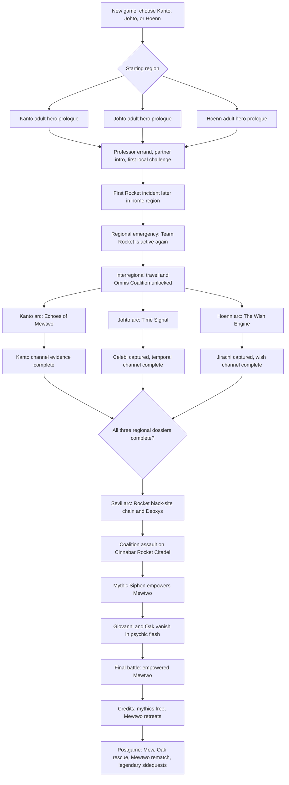
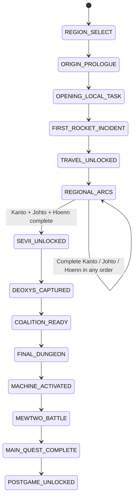
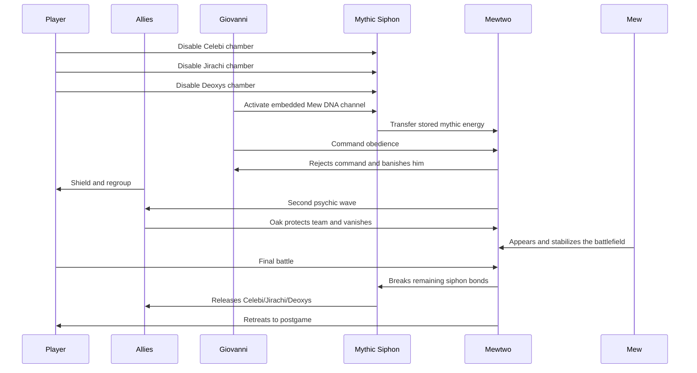

# Pokemon Omnis Main Story Timeline

This is the source-of-truth planning file for the main quest. Update this file first when the story changes, then update scripts, maps, flags, dialogue, trainers, and cutscenes to match it.

The visual sections use Mermaid diagrams inside Markdown. They render in GitHub and many Markdown previewers, while still staying readable as plain text.

## Canon For v0.2

- The player chooses Kanto, Johto, or Hoenn during the new-game intro. The repo already stores this as `gSaveBlock2Ptr->playerRegion` and exposes it to scripts through `checkplayerregion`.
- The chosen region determines the player identity: Red or Leaf for Kanto, Ethan or Kris for Johto, Brendan or May for Hoenn. If implementation uses a Lyra-labeled sprite internally, treat it as the Johto female protagonist slot for this story. The unchosen regional heroes appear as older NPC allies.
- All original main characters are adults with their own homes, jobs, and histories. They are not starting as children living with parents.
- Giovanni has returned and leads Team Rocket again. His hidden project is a created Mewtwo powered by a Mythic Siphon machine.
- The heroes do not know this at the start. Early Rocket incidents should look like thefts, raids, and industrial crimes until the regional dossiers reveal the larger pattern.
- The machine needs four mythic inputs: a Mew-derived genetic channel, Celebi's temporal channel, Jirachi's wish channel, and Deoxys's extraterrestrial mutation channel.
- Mew is not physically captured in the main quest. Giovanni uses Mew DNA, Cinnabar research, and residue from the original Mewtwo project as the Kanto input. This keeps Mew unique and reserves it as a postgame reward.
- Celebi, Jirachi, and Deoxys are captured during the Johto, Hoenn, and Sevii arcs. These are story captures only and must not set player-caught or defeated flags.
- Cinnabar Island is occupied by Team Rocket late in the Kanto arc and remains the site of the finale. Blaine has been forced out. The Cinnabar Gym becomes an abandoned Rocket-occupied battle dungeon and does not award a badge while occupied.
- The main climax happens under Cinnabar Island, in a Rocket citadel built into the Pokemon Mansion basement, Pokemon Lab ruins, and a new lower facility.
- At the climax, the machine empowers Mewtwo. Mewtwo immediately rejects Giovanni and banishes him in a psychic flash. The player does not know whether Giovanni died.
- Professor Oak is also banished while shielding the player and the allied heroes. This gives the climax a personal cost and gives the postgame Mew event a concrete purpose.
- The player defeats the empowered Mewtwo, but does not catch it in the main quest. Mewtwo retreats after regaining control. Cerulean Cave becomes its postgame rematch/capture location.
- After credits, Faraway Island unlocks. Mew appears there as the reward for completing the main quest and as the key to finding/rescuing Oak.

## Narrative Pillars

- Each regional arc is a full investigation across that region, not a single-city legendary errand.
- Each regional arc has a clear subject:
  - Kanto: Giovanni rebuilds the Mewtwo project by recovering old Rocket science, psychic control tech, power infrastructure, and Mew-derived research.
  - Johto: Rocket weaponizes time folklore, Radio Tower infrastructure, Unown prediction, and Apricorn capture craft to trap Celebi.
  - Hoenn: Rocket turns meteor science, Devon engineering, weather research, and wish folklore into a Jirachi extraction system.
  - Sevii: Rocket uses the islands as a black-site logistics chain and final Deoxys hunt.
- The player is usually too late to stop the mythic capture, but each arc gives the alliance evidence, disables part of Rocket's network, and makes the final assault possible.
- Legendary Pokemon are not checklist bosses in the main story. They appear as omens, territorial reactions, guardians, or postgame seeds.
- Every arc must work no matter which region the player started in. Use region-specific dialogue for player identity, not completely separate plot logic.
- The opening of each region is deliberately ordinary. The professor, player, and local partner do not know Team Rocket is active, and they know nothing about Giovanni, Mewtwo, mythic channels, or the Mythic Siphon.

## Existing Repo Hooks

Use these existing hooks before adding new systems:

| Need | Existing hook |
| --- | --- |
| Region choice | `src/main_menu.c` already has Kanto/Johto/Hoenn selection. |
| Region checks in scripts | `checkplayerregion` sets `VAR_RESULT` to `KANTO`, `JOHTO`, or `HOENN`. |
| First warp by region | `data/maps/InsideOfTruck/scripts.inc` already routes to Pallet, New Bark, or Littleroot. |
| Player sprites by region | `src/main_menu.c`, `src/field_player_avatar.c`, and battle controllers already branch by `playerRegion`. |
| Mythic overworld sprites | `OBJ_EVENT_GFX_MEW`, `OBJ_EVENT_GFX_CELEBI`, `OBJ_EVENT_GFX_MEWTWO`, `OBJ_EVENT_GFX_JIRACHI`, `OBJ_EVENT_GFX_DEOXYS`. |
| Existing mythic event flags | `FLAG_HIDE_MEW`, `FLAG_HIDE_ILEX_FOREST_CELEBI`, `FLAG_HIDE_DEOXYS`, `FLAG_HIDE_BIRTH_ISLAND_DEOXYS_TRIANGLE`, `FLAG_CAUGHT_MEW`, `FLAG_CAUGHT_OR_DEFEATED_CELEBI`, `FLAG_DEFEATED_DEOXYS`. |
| Broad Kanto maps | Pallet, Viridian, Pewter, Cerulean, Lavender, Vermilion, Celadon, Fuchsia, Saffron, Cinnabar, Indigo, Mt. Moon, Rock Tunnel, Power Plant, Seafoam, Pokemon Tower, Silph Co., Rocket Hideout, Safari Zone, Cerulean Cave. |
| Broad Johto maps | New Bark, Violet, Azalea, Goldenrod, Ecruteak, Olivine, Cianwood, Mahogany, Blackthorn, Ruins of Alph, Ilex Forest, Burned Tower, Tin Tower, Lake of Rage, Whirl Islands, Dragon's Den, Tohjo Falls, Mt. Silver. |
| Broad Hoenn maps | Littleroot, Rustboro, Slateport, Dewford, Mauville, Fallarbor, Lavaridge, Fortree, Lilycove, Mossdeep, Sootopolis, Pacifidlog, Devon Corp, Granite Cave, Meteor Falls, Mt. Chimney, Weather Institute, Mt. Pyre, New Mauville, Sky Pillar, Seafloor Cavern. |
| Broad Sevii maps | One through Seven Island, Icefall Cave, Five Island Rocket Warehouse, Dotted Hole, Tanoby Ruins, Birth Island, Faraway Island, Navel Rock if reused. |

Do not use player-caught flags for Team Rocket story captures. Story capture needs separate `OMNIS` flags so the Pokedex, postgame encounters, and event rewards stay clean.

## Visual Main Timeline

## Main Quest State Machine

## Regional Arc Dependencies

```mermaid
flowchart LR
    subgraph Kanto["Kanto: Echoes of Mewtwo"]
        K1[Pewter Museum theft] --> K2[Mt. Moon fossil stabilizer]
        K2 --> K3[Viridian command cache]
        K3 --> K4[Cerulean Cave psychic residue]
        K4 --> K5[Power Plant containment grid]
        K5 --> K6[Saffron Silph psi-limiter]
        K6 --> K7[Celadon Rocket ledger]
        K7 --> K8[Lavender Fuji confession]
        K8 --> K9[Fuchsia capture-field trial]
        K9 --> K10[Seafoam and Cinnabar lockdown]
        K10 --> K11[Mansion DNA channel stolen]
    end

    subgraph Johto["Johto: Time Signal"]
        J1[Sprout Tower raid] --> J2[Violet tower omen]
        J2 --> J3[Ruins of Alph Unown cipher]
        J3 --> J4[Azalea Apricorn theft]
        J4 --> J5[Goldenrod Radio Tower signal]
        J5 --> J6[Ecruteak Burned Tower memory]
        J6 --> J7[Lake of Rage/Mahogany amplifier]
        J7 --> J8[Olivine/Cianwood sea relay]
        J8 --> J9[Blackthorn Dragon's Den future scar]
        J9 --> J10[Ilex Forest Celebi trap]
    end

    subgraph Hoenn["Hoenn: The Wish Engine"]
        H1[Devon Corp break-in] --> H2[Rustboro Devon design]
        H2 --> H3[Slateport meteor lens theft]
        H3 --> H4[Dewford/Granite Cave star chart]
        H4 --> H5[Fallarbor/Meteor Falls wish core]
        H5 --> H6[Mt. Chimney thermal forge]
        H6 --> H7[Weather Institute resonance]
        H7 --> H8[Lilycove/Mt. Pyre archive]
        H8 --> H9[Mossdeep Space Center raid]
        H9 --> H10[Sky Pillar warning]
        H10 --> H11[Jirachi capture]
    end

    K11 --> S1[Sevii access]
    J10 --> S1
    H11 --> S1

    S1 --> S2[One Island network trace]
    S2 --> S3[Four Island Lorelei lead]
    S3 --> S4[Five Island Warehouse]
    S4 --> S5[Six/Seven Island ancient coordinates]
    S5 --> S6[Birth Island Deoxys ambush]
    S6 --> F1[Final dungeon unlocked]
```

## Cast Matrix

| Group | Characters | Main role |
| --- | --- | --- |
| Player identity | Red/Leaf, Ethan/Kris, Brendan/May depending region and gender | The selected adult hero. Starts with a fresh investigation team for gameplay balance. |
| Kanto allies | Unselected Red/Leaf, Blue, Oak, Blaine, Mr. Fuji, Bill, Sabrina, Silph scientists, Brock/Misty cameos as needed | Expose Giovanni's reconstruction of the Mewtwo project and prove the Kanto input is Mew-derived research, not a captured Mew. |
| Johto allies | Unselected Ethan/Kris, Silver, Elm, Kurt, Kimono Girls, Eusine, Jasmine, Clair | Decode Rocket's time signal and fail to stop Celebi's capture, while seeding Ho-Oh/Lugia/beasts postgame threads. |
| Hoenn allies | Unselected Brendan/May, Wally, Birch, Steven, Devon scientists, Captain Stern, Professor Cozmo, Mossdeep staff, Wallace | Trace the wish-energy core from meteor science to Mossdeep and fail to stop Jirachi's capture, while seeding weather-trio and Regi postgame threads. |
| Sevii allies | Celio, Lorelei, Bill, Rocket informant/admin turncoat, island elders | Trace Rocket shipping routes, decrypt Birth Island coordinates, and expose the final Deoxys channel. |
| Villains | Giovanni, Rocket admins, Rocket scientists, Rocket grunts, optional defecting admin | Rebuild Team Rocket around mythic-energy extraction instead of simple crime. Giovanni is colder and more patient than before. |
| Mythics | Mew, Celebi, Jirachi, Deoxys, Mewtwo | Mew stays free. Celebi/Jirachi/Deoxys are captured. Mewtwo becomes the false vessel and final threat. |

## Story Variables To Add

Prefer a small number of vars and many named flags. Assign exact IDs during implementation after checking `include/constants/vars.h`.

| Var | Values | Purpose |
| --- | --- | --- |
| `VAR_OMNIS_MAIN_STORY` | `0, 10, 20...120` | Main quest global phase. |
| `VAR_OMNIS_KANTO_ARC` | `0, 10, 20...100` | Kanto story progress. |
| `VAR_OMNIS_JOHTO_ARC` | `0, 10, 20...100` | Johto story progress. |
| `VAR_OMNIS_HOENN_ARC` | `0, 10, 20...100` | Hoenn story progress. |
| `VAR_OMNIS_SEVII_ARC` | `0, 10, 20...100` | Sevii story progress. |
| `VAR_OMNIS_FINAL_DUNGEON` | `0, 10, 20...100` | Cinnabar Rocket Citadel progress. |
| `VAR_OMNIS_ACTIVE_ALLY` | enum | Which major ally should appear in shared cutscenes. |
| `VAR_OMNIS_PROFESSOR_STATE` | enum | Oak present, Oak banished, Oak rescued. |
| `VAR_OMNIS_ROCKET_INTEL_COUNT` | `0...4` | Optional tally for dossier summaries, useful if arcs can be completed out of order. |

Suggested `VAR_OMNIS_MAIN_STORY` values:

| Value | Meaning |
| --- | --- |
| `0` | New game / not initialized. |
| `10` | Region chosen and adult-home prologue active. |
| `15` | Opening professor errand, partner intro, and first local challenge active or complete. |
| `20` | First home-region Rocket incident complete. |
| `30` | Interregional travel unlocked. |
| `40` | Regional mythic arcs active. |
| `50` | Kanto, Johto, and Hoenn arcs complete. |
| `60` | Sevii arc unlocked. |
| `70` | Deoxys captured by Rocket. |
| `80` | Coalition assault ready. |
| `90` | Final dungeon entered. |
| `100` | Mythic Siphon activated; Giovanni and Oak banished. |
| `110` | Mewtwo defeated. |
| `120` | Main quest complete; postgame unlocked. |

## Story Flags To Add

Use `FLAG_OMNIS_` for permanent story flags and `FLAG_HIDE_OMNIS_` for object visibility. Exact numeric allocation is intentionally deferred.

### Core Flags

| Flag | Set when |
| --- | --- |
| `FLAG_OMNIS_REGION_CHOICE_COMPLETE` | New-game region choice is locked in. |
| `FLAG_OMNIS_ORIGIN_PROLOGUE_COMPLETE` | The selected region's adult-home intro is complete. |
| `FLAG_OMNIS_OPENING_PARTNER_MET` | The selected region's local partner/counterpart has been introduced. |
| `FLAG_OMNIS_OPENING_FIELD_TASK_COMPLETE` | The professor's ordinary opening errand or local challenge is complete. |
| `FLAG_OMNIS_FIRST_ROCKET_INCIDENT_COMPLETE` | The player's first local Rocket incident is complete. |
| `FLAG_OMNIS_INTERREGIONAL_TRAVEL_UNLOCKED` | Ferries, Fly gates, Magnet Train, or other region travel routes open. |
| `FLAG_OMNIS_COALITION_FORMED` | All regional heroes agree to work together. |
| `FLAG_OMNIS_MAIN_QUEST_COMPLETE` | Credits have rolled after Mewtwo is defeated. |

### Kanto Flags

| Flag | Set when |
| --- | --- |
| `FLAG_OMNIS_KANTO_ARC_STARTED` | Pewter Museum theft reveals Team Rocket activity in Kanto. |
| `FLAG_OMNIS_PEWTER_MUSEUM_THEFT_CLEARED` | Rocket's Pewter Museum theft event is cleared. |
| `FLAG_OMNIS_VIRIDIAN_CACHE_CLEARED` | Giovanni's old Viridian command cache is cleared. |
| `FLAG_OMNIS_MT_MOON_STABILIZER_FOUND` | Rocket's fossil/Moon Stone stabilizer lead is found. |
| `FLAG_OMNIS_CERULEAN_RESIDUE_SCANNED` | Cerulean Cave psychic residue confirms Mewtwo resonance. |
| `FLAG_OMNIS_POWER_PLANT_GRID_DISABLED` | Rocket's containment power siphon is shut down. |
| `FLAG_OMNIS_SILPH_PSI_LIMITER_RECOVERED` | Silph psi-limiter plans are recovered. |
| `FLAG_OMNIS_ROCKET_LEDGER_FOUND` | Celadon ledger ties Kanto materials to other regions and Sevii. |
| `FLAG_OMNIS_KANTO_CARGO_CONFIRMED` | Optional cross-region cargo stop confirms the Kanto shipment trail in Olivine or Slateport. |
| `FLAG_OMNIS_FUJI_CONFESSION_HEARD` | Mr. Fuji explains the human cost of the original Mewtwo project. |
| `FLAG_OMNIS_FUCHSIA_CAPTURE_TRIAL_CLEARED` | Rocket's live capture-field trial is stopped. |
| `FLAG_OMNIS_CINNABAR_ROCKET_OCCUPIED` | Cinnabar map switches to Rocket occupation state. |
| `FLAG_OMNIS_CINNABAR_GYM_DISABLED` | Gym badge reward is disabled and Blaine is absent. |
| `FLAG_OMNIS_CINNABAR_GYM_GRUNTS_CLEARED` | Abandoned Gym battle dungeon is cleared. |
| `FLAG_OMNIS_BLAINE_RESCUED` | Blaine is recovered or contacts the team. |
| `FLAG_OMNIS_MANSION_DNA_LOG_FOUND` | The player reads the Mew/Mewtwo origin logs. |
| `FLAG_OMNIS_MEW_DNA_SAMPLE_STOLEN` | Rocket ships the Mew DNA channel to the final machine. |
| `FLAG_OMNIS_KANTO_MYTHIC_LEAD_COMPLETE` | Kanto arc is complete. |

### Johto Flags

| Flag | Set when |
| --- | --- |
| `FLAG_OMNIS_JOHTO_ARC_STARTED` | Sprout Tower raid reveals Team Rocket activity in Johto. |
| `FLAG_OMNIS_SPROUT_TOWER_RAID_CLEARED` | Rocket's Sprout Tower raid event is cleared. |
| `FLAG_OMNIS_VIOLET_OMEN_SEEN` | Sprout Tower/Violet event reveals time-displaced growth. |
| `FLAG_OMNIS_RUINS_UNOWN_CIPHER_FOUND` | Ruins of Alph cipher shows Rocket is predicting Celebi, not summoning it. |
| `FLAG_OMNIS_AZALEA_APRICORN_THEFT_CLEARED` | Kurt's stolen Apricorn capture tech lead is resolved. |
| `FLAG_OMNIS_GOLDENROD_SIGNAL_CLEARED` | Radio Tower/Underground Rocket signal event is cleared. |
| `FLAG_OMNIS_ECRUTEAK_MEMORY_SEEN` | Burned Tower/Kimono Girls memory sequence reveals the emotional cost of misusing time. |
| `FLAG_OMNIS_LAKE_OF_RAGE_AMPLIFIER_DISABLED` | Mahogany/Lake of Rage temporal amplifier is shut down. |
| `FLAG_OMNIS_OLIVINE_SEA_RELAY_CLEARED` | Olivine/Cianwood relay links Johto signal to other regions. |
| `FLAG_OMNIS_BLACKTHORN_FUTURE_SCAR_SEEN` | Dragon's Den or Ice Path shows a future damaged by Rocket's machine. |
| `FLAG_OMNIS_ILEX_FOREST_AMBUSH_STARTED` | The Celebi trap scene begins. |
| `FLAG_OMNIS_CELEBI_CAPTURED_BY_ROCKET` | Rocket captures Celebi in-story. |
| `FLAG_OMNIS_UNOWN_SIDEQUEST_SEEDED` | Unown power is teased for a later optional quest. |
| `FLAG_OMNIS_JOHTO_MYTHIC_LEAD_COMPLETE` | Johto arc is complete. |

### Hoenn Flags

| Flag | Set when |
| --- | --- |
| `FLAG_OMNIS_HOENN_ARC_STARTED` | Devon Corp break-in reveals Team Rocket activity in Hoenn. |
| `FLAG_OMNIS_DEVON_BREAKIN_CLEARED` | Rocket's Devon Corp break-in event is cleared. |
| `FLAG_OMNIS_DEVON_WISH_ENGINE_IDENTIFIED` | Devon confirms the stolen parts form an unknown energy resonator, later understood as the Wish Engine. |
| `FLAG_OMNIS_SLATEPORT_METEOR_LENS_STOLEN` | Rocket steals or hijacks the meteor lens shipment. |
| `FLAG_OMNIS_GRANITE_STAR_CHART_FOUND` | Granite Cave/Steven lead explains the Millennium Comet window. |
| `FLAG_OMNIS_WISH_CORE_IDENTIFIED` | Meteor Falls/Cozmo confirms the wish core. |
| `FLAG_OMNIS_METEORITE_CORE_STOLEN` | Rocket steals the Meteorite/wish core. |
| `FLAG_OMNIS_MT_CHIMNEY_FORGE_DISABLED` | Mt. Chimney or Magma Hideout forge is disabled. |
| `FLAG_OMNIS_WEATHER_RESONANCE_CLEARED` | Weather Institute shows the machine is disturbing regional climate. |
| `FLAG_OMNIS_MT_PYRE_ARCHIVE_READ` | Mt. Pyre/Lilycove archive connects wishes, spirits, and meteors. |
| `FLAG_OMNIS_HOENN_RELAY_CONFIRMED` | Optional cross-region relay check ties Hoenn readings to Kanto or Johto infrastructure. |
| `FLAG_OMNIS_MOSSDEEP_SPACE_CENTER_RAID_STARTED` | Rocket raid on Mossdeep starts. |
| `FLAG_OMNIS_MOSSDEEP_RAID_CLEARED` | Grunts/admins in Space Center are beaten. |
| `FLAG_OMNIS_JIRACHI_AWAKENED` | Jirachi appears to shield people from the machine. |
| `FLAG_OMNIS_JIRACHI_CAPTURED_BY_ROCKET` | Rocket captures Jirachi in-story. |
| `FLAG_OMNIS_SKY_PILLAR_WARNING_SEEN` | Rayquaza/Sky Pillar warning omen has played. |
| `FLAG_OMNIS_HOENN_MYTHIC_LEAD_COMPLETE` | Hoenn arc is complete. |

### Sevii Flags

| Flag | Set when |
| --- | --- |
| `FLAG_OMNIS_SEVII_ARC_STARTED` | Celio/Lorelei gives the Rocket black-site lead. |
| `FLAG_OMNIS_ONE_ISLAND_NETWORK_TRACED` | Celio traces encrypted traffic across the islands. |
| `FLAG_OMNIS_SEVII_LOGISTICS_EXPOSED` | Optional Two/Three Island logistics events are cleared. |
| `FLAG_OMNIS_FOUR_ISLAND_LORELEI_RESCUED` | Lorelei's Icefall Cave lead is cleared. |
| `FLAG_OMNIS_FIVE_ISLAND_ROCKET_WAREHOUSE_CLEARED` | Warehouse dungeon is cleared. |
| `FLAG_OMNIS_DOTTED_HOLE_CODE_FOUND` | Six Island/Tanoby code reveals Birth Island coordinates. |
| `FLAG_OMNIS_BIRTH_ISLAND_COORDINATES_FOUND` | Birth Island access is unlocked. |
| `FLAG_OMNIS_BIRTH_ISLAND_ROCKET_AMBUSH_STARTED` | Rocket interrupts the Deoxys puzzle/encounter. |
| `FLAG_OMNIS_DEOXYS_CAPTURED_BY_ROCKET` | Rocket captures Deoxys in-story. |
| `FLAG_OMNIS_SEVII_MYTHIC_LEAD_COMPLETE` | Sevii arc is complete. |

### Finale Flags

| Flag | Set when |
| --- | --- |
| `FLAG_OMNIS_FINAL_DUNGEON_UNLOCKED` | Cinnabar Rocket Citadel can be entered. |
| `FLAG_OMNIS_FINAL_DUNGEON_ENTERED` | Player begins the final assault. |
| `FLAG_OMNIS_CELEBI_CHAMBER_DISABLED` | Celebi's siphon chamber is disabled. |
| `FLAG_OMNIS_JIRACHI_CHAMBER_DISABLED` | Jirachi's siphon chamber is disabled. |
| `FLAG_OMNIS_DEOXYS_CHAMBER_DISABLED` | Deoxys's siphon chamber is disabled. |
| `FLAG_OMNIS_MEW_DNA_CHANNEL_ACTIVE` | The Mew DNA input is activated. |
| `FLAG_OMNIS_MYTHIC_SIPHON_ACTIVATED` | Machine empowers Mewtwo. |
| `FLAG_OMNIS_GIOVANNI_BANISHED` | Mewtwo removes Giovanni in the psychic flash. |
| `FLAG_OMNIS_OAK_BANISHED` | Oak is removed while protecting the team. |
| `FLAG_OMNIS_MEW_APPEARED_AT_CLIMAX` | Mew appears but is not caught. |
| `FLAG_OMNIS_MEWTWO_DEFEATED` | Final battle is won. |
| `FLAG_OMNIS_MYTHICALS_RELEASED` | Celebi, Jirachi, and Deoxys are freed. |
| `FLAG_OMNIS_MEWTWO_RETREATED` | Mewtwo leaves for postgame. |
| `FLAG_OMNIS_POSTGAME_UNLOCKED` | Postgame gates open. |
| `FLAG_OMNIS_FARAWAY_ISLAND_UNLOCKED` | Mew/Oak rescue quest is unlocked. |
| `FLAG_OMNIS_CERULEAN_CAVE_MEWTWO_UNLOCKED` | Mewtwo rematch/capture is unlocked. |

## Beat Register

### Shared Opening

| Beat | Story | Implementation tasks | State changes |
| --- | --- | --- | --- |
| `OMNIS-000` | New-game intro asks region. The framing is not "a child begins a journey"; it is "a known regional hero returns home after years away and is eventually pulled into a coordinated crisis." | Keep the existing Kanto/Johto/Hoenn menu. Rewrite intro text in `data/text/birch_speech.inc`. | Set `FLAG_OMNIS_REGION_CHOICE_COMPLETE`, `VAR_OMNIS_MAIN_STORY = 10`. |
| `OMNIS-010K` | Kanto start: the player arrives at an adult home in Pallet. Oak gives a normal research errand: deliver a parcel, check a field note, or bring a basic Pokedex report to the next town. Blue or the Kanto counterpart appears as a working partner, not an antagonist. | Pallet home/Oak Lab intro. Keep the tone grounded and routine. The partner can push the player toward Viridian/Pewter, a first Gym check, or catching a small number of Pokemon. | Set `VAR_OMNIS_ACTIVE_ALLY` to Kanto counterpart, `FLAG_OMNIS_OPENING_PARTNER_MET`. |
| `OMNIS-010J` | Johto start: the player arrives at an adult home in New Bark. Elm gives a harmless local errand toward Cherrygrove/Violet: deliver research notes, check on an Egg, or collect a field reading. Ethan/Kris/Silver is introduced as the regional partner. | New Bark home/Elm Lab intro. The partner can encourage Violet Gym, Sprout Tower sightseeing, or a small catching goal. No temporal anomaly yet. | Set `VAR_OMNIS_ACTIVE_ALLY` to Johto counterpart, `FLAG_OMNIS_OPENING_PARTNER_MET`. |
| `OMNIS-010H` | Hoenn start: the player arrives at an adult home in Littleroot. Birch asks for a simple field survey or sample delivery toward Oldale/Petalburg/Rustboro. Brendan/May and Wally are introduced as friendly counterparts in the local route loop. | Littleroot home/Birch Lab intro. The partner can suggest a first Gym route, catching task, or Devon errand, but no one suspects criminal activity. | Set `VAR_OMNIS_ACTIVE_ALLY` to Hoenn counterpart, `FLAG_OMNIS_OPENING_PARTNER_MET`. |
| `OMNIS-015` | The ordinary opening task is completed. The player has met the regional partner and has a local short-term goal: first Gym attempt, catch target, Pokedex check, or delivery follow-up. | Add route/town scripts that make the first hour feel like a normal Pokemon journey for an adult returning to the field. | Set `FLAG_OMNIS_OPENING_FIELD_TASK_COMPLETE`, `VAR_OMNIS_MAIN_STORY = 15`. |
| `OMNIS-020K` | Kanto first Rocket incident: the player reaches Pewter and finds Team Rocket stealing fossil restoration notes, Moon Stone samples, or a museum archive. Oak and the player did not know Rocket was active before this. | Pewter Museum event. Rocket grunts escape with enough material to justify the Mt. Moon follow-up. | Set `FLAG_OMNIS_FIRST_ROCKET_INCIDENT_COMPLETE`, `FLAG_OMNIS_KANTO_ARC_STARTED`, `FLAG_OMNIS_PEWTER_MUSEUM_THEFT_CLEARED`, `VAR_OMNIS_MAIN_STORY = 20`. |
| `OMNIS-020J` | Johto first Rocket incident: the player reaches Violet and finds Team Rocket raiding Sprout Tower for old tower records, ritual timing notes, or Bellsprout growth observations. Elm and the player did not know Rocket was active before this. | Sprout Tower event. Rocket escapes with an incomplete clue that later points to Ruins of Alph and Goldenrod. | Set `FLAG_OMNIS_FIRST_ROCKET_INCIDENT_COMPLETE`, `FLAG_OMNIS_JOHTO_ARC_STARTED`, `FLAG_OMNIS_SPROUT_TOWER_RAID_CLEARED`, `VAR_OMNIS_MAIN_STORY = 20`. |
| `OMNIS-020H` | Hoenn first Rocket incident: the player reaches Rustboro and catches Team Rocket breaking into Devon Corp. At first it looks like ordinary industrial theft, not a mythic plot. Birch and the player did not know Rocket was active before this. | Devon Corp event. Rocket escapes with prototype components or research records that Devon cannot identify immediately. | Set `FLAG_OMNIS_FIRST_ROCKET_INCIDENT_COMPLETE`, `FLAG_OMNIS_HOENN_ARC_STARTED`, `FLAG_OMNIS_DEVON_BREAKIN_CLEARED`, `VAR_OMNIS_MAIN_STORY = 20`. |
| `OMNIS-030` | Oak, Elm, Birch, Blue, Silver, Steven, and the unchosen heroes compare the first incident. They know Team Rocket is active again, but they still do not know Giovanni's goal, the Mewtwo vessel, or the mythic channels. | Add call/cutscene. Unlock ferry/Fly/travel gates and regional hub dialogue. | Set `FLAG_OMNIS_INTERREGIONAL_TRAVEL_UNLOCKED`, `VAR_OMNIS_MAIN_STORY = 30`. |
| `OMNIS-040` | The Omnis Coalition forms. The player may investigate the Kanto, Johto, and Hoenn dossiers in any order. | Hub dialogue should list open dossiers and summarize completed ones. | Set `FLAG_OMNIS_COALITION_FORMED`, `VAR_OMNIS_MAIN_STORY = 40`. |

### Kanto Arc: Echoes Of Mewtwo

Kanto is not about chasing Mew. Kanto begins as a normal Pallet-to-Pewter outing and turns when Team Rocket robs Pewter Museum. From there, it becomes an investigation proving that Giovanni has rebuilt the old Mewtwo project from stolen research, old Rocket infrastructure, Silph control tech, power-grid theft, and a surviving Mew-derived sample. The player moves through Kanto's whole criminal history and sees how every old Rocket scar has become a component in the new machine.

| Beat | Story | Implementation tasks | State changes |
| --- | --- | --- | --- |
| `KANTO-010` | Pewter Museum is robbed during what should have been a routine local errand. Rocket steals fossil restoration data, Moon Stone samples, or old Cinnabar research citations. Brock and the museum staff initially read it as theft, not a mythic plot. | Pewter Museum NPCs, first Rocket battle, partner reaction. If Kanto is the starting region, this doubles as the player's first Rocket reveal. | Set `FLAG_OMNIS_KANTO_ARC_STARTED`, `FLAG_OMNIS_PEWTER_MUSEUM_THEFT_CLEARED`, `VAR_OMNIS_KANTO_ARC = 10`. |
| `KANTO-020` | Mt. Moon reveals the theft was targeted. Rocket is using fossil restoration data and Moon Stone catalysts to stabilize unstable clone tissue. | Mt. Moon mini-dungeon or scientist battle. Reward fossil stabilizer notes. | Set `FLAG_OMNIS_MT_MOON_STABILIZER_FOUND`, `VAR_OMNIS_KANTO_ARC = 20`. |
| `KANTO-030` | Viridian Gym has been reopened as a sealed Rocket command cache. The player finds Giovanni's old contingency orders: if Mew cannot be caught, recover the science that made Mewtwo possible. | Viridian Gym or hidden basement event. Admin battle. Recover "Black Ledger Page 1." | Set `FLAG_OMNIS_VIRIDIAN_CACHE_CLEARED`, `VAR_OMNIS_KANTO_ARC = 30`. |
| `KANTO-040` | Cerulean Cave reacts to the new Mewtwo project even though the original Mewtwo is gone. Misty/Blue notes that the cave feels like an echo chamber, not a nest. | Cerulean Cave static event, no Mewtwo battle. Psychic pulse knocks out Rocket equipment. | Set `FLAG_OMNIS_CERULEAN_RESIDUE_SCANNED`, `VAR_OMNIS_KANTO_ARC = 35`. |
| `KANTO-050` | Power Plant is being drained to feed containment coils. Zapdos may appear as a hostile warning or blackout omen, not as a capture target. | Power Plant grunts, switch puzzle, optional Zapdos silhouette/cry. | Set `FLAG_OMNIS_POWER_PLANT_GRID_DISABLED`, `VAR_OMNIS_KANTO_ARC = 40`. |
| `KANTO-060` | Saffron's Silph Co. has been infiltrated for psi-limiter plans: a device meant to restrain a psychic Pokemon without a Pokeball. Sabrina senses a mind that has not fully awakened yet. | Silph floors as story dungeon. Sabrina/Blue ally dialogue. Recover psi-limiter plan. | Set `FLAG_OMNIS_SILPH_PSI_LIMITER_RECOVERED`, `VAR_OMNIS_KANTO_ARC = 45`. |
| `KANTO-070` | Celadon Rocket Hideout contains the finance and shipping ledger. It ties Kanto stolen materials to Goldenrod, Slateport, Five Island, and Cinnabar. | Rocket Hideout pass, ledger item, admin battle. This beat justifies cross-region spillover. | Set `FLAG_OMNIS_ROCKET_LEDGER_FOUND`, `VAR_OMNIS_KANTO_ARC = 50`. |
| `KANTO-080` | Vermilion docks show Rocket containers moving through Johto and Hoenn under false League inspection seals. The player can make a short cross-region stop at Olivine or Slateport to confirm the same shipping marks. | Dock cutscene; optional same-script cargo NPC in Olivine/Slateport based on travel state. | Optional set `FLAG_OMNIS_KANTO_CARGO_CONFIRMED`. |
| `KANTO-090` | Lavender and Pokemon Tower give the moral core. Mr. Fuji admits what he knows of the original Mewtwo project and warns that the new project is worse: Giovanni is trying to build obedience into a being that was born from suffering. | Pokemon Tower/Fuji House scene. No battle required. Add somber music if possible. | Set `FLAG_OMNIS_FUJI_CONFESSION_HEARD`, `VAR_OMNIS_KANTO_ARC = 60`. |
| `KANTO-100` | Fuchsia Safari Zone is used to test live capture fields on rare Pokemon. The player shuts it down before Rocket can scale the tech to mythics. | Safari Zone overworld grunts, gate blockers, rare Pokemon panic scene. | Set `FLAG_OMNIS_FUCHSIA_CAPTURE_TRIAL_CLEARED`, `VAR_OMNIS_KANTO_ARC = 70`. |
| `KANTO-110` | Seafoam and Route 20 show ecological fallout: Articuno/Moltres omens, rough seas, and Rocket patrols routing everything toward Cinnabar. Blaine is missing. | Seafoam/Route 20 event, Cinnabar blockers, island state change. | Set `FLAG_OMNIS_CINNABAR_ROCKET_OCCUPIED`, `FLAG_OMNIS_CINNABAR_GYM_DISABLED`, `VAR_OMNIS_KANTO_ARC = 80`. |
| `KANTO-120` | Cinnabar Gym is now a Rocket guard post and training room. Clearing it gives a lab keycard, not a badge. | Replace badge trainers with Rocket grunts/admin or add Rocket overlay. | Set `FLAG_OMNIS_CINNABAR_GYM_GRUNTS_CLEARED`, `VAR_OMNIS_KANTO_ARC = 85`. |
| `KANTO-130` | Pokemon Mansion B1F reveals the key answer: Giovanni never captured Mew. He recovered a Mew-derived sample and old research sufficient to power one channel of the Mythic Siphon. | Add readable logs, lab terminals, scientist battles, locked lab room. | Set `FLAG_OMNIS_MANSION_DNA_LOG_FOUND`, `VAR_OMNIS_KANTO_ARC = 90`. |
| `KANTO-140` | Rocket escapes with the Mew DNA channel. Mew briefly appears as an unreachable watcher, proving it is free and aware. Blaine confirms the new Mewtwo is not the old Cerulean Cave Mewtwo. | Dock/roof escape cutscene, admin battle, non-catchable Mew object, Blaine rescue/contact. | Set `FLAG_OMNIS_MEW_DNA_SAMPLE_STOLEN`, `FLAG_OMNIS_BLAINE_RESCUED`, `FLAG_OMNIS_KANTO_MYTHIC_LEAD_COMPLETE`, `VAR_OMNIS_KANTO_ARC = 100`. |

### Johto Arc: Time Signal

Johto begins as a normal New Bark-to-Violet errand and turns when Team Rocket raids Sprout Tower. Johto is about Rocket turning folklore into a machine. They are not summoning Celebi by force at first. They are using Unown, radio infrastructure, Apricorn capture craft, and old Rocket signal networks to predict when Celebi will appear to repair time damage. The player gradually realizes every "glitch" is bait.

| Beat | Story | Implementation tasks | State changes |
| --- | --- | --- | --- |
| `JOHTO-010` | Sprout Tower is raided during what should have been a local Violet errand. Rocket steals old tower records, ritual timing notes, and unusual growth observations. Elm, Silver, and the player did not know Rocket was active before this. | Sprout Tower first Rocket battle, Elder/Sage aftermath, partner reaction. If Johto is the starting region, this doubles as the player's first Rocket reveal. | Set `FLAG_OMNIS_JOHTO_ARC_STARTED`, `FLAG_OMNIS_SPROUT_TOWER_RAID_CLEARED`, `VAR_OMNIS_JOHTO_ARC = 10`. |
| `JOHTO-020` | Violet City and Sprout Tower show the first impossible aftereffect: plants recover too quickly, bells repeat a rhythm no one rang, or monks remember a minute that has not happened. The player sees that Celebi-like restoration is happening without Celebi present. | Violet/Sprout Tower anomaly event, light puzzle, Sage dialogue. | Set `FLAG_OMNIS_VIOLET_OMEN_SEEN`, `VAR_OMNIS_JOHTO_ARC = 20`. |
| `JOHTO-030` | Ruins of Alph reveals repeating Unown patterns. The message does not say "call Celebi"; it predicts when Celebi will appear if the timeline is wounded enough. | Add Unown wall puzzle/readable glyphs. Seed postgame Unown quest. | Set `FLAG_OMNIS_RUINS_UNOWN_CIPHER_FOUND`, `FLAG_OMNIS_UNOWN_SIDEQUEST_SEEDED`, `VAR_OMNIS_JOHTO_ARC = 25`. |
| `JOHTO-040` | Azalea and Slowpoke Well show Rocket stealing Kurt's Apricorn research to build a softer mythic containment shell, different from Silph's harsh psi-limiter. | Kurt's House/Slowpoke Well event, Rocket theft aftermath. | Set `FLAG_OMNIS_AZALEA_APRICORN_THEFT_CLEARED`, `VAR_OMNIS_JOHTO_ARC = 35`. |
| `JOHTO-050` | Goldenrod Radio Tower and Underground broadcast the temporal signal regionwide. The player shuts it down, but Silver notices the signal had already finished uploading to repeaters. | Radio Tower/Underground dungeon, executive battle, shutoff switch. | Set `FLAG_OMNIS_GOLDENROD_SIGNAL_CLEARED`, `VAR_OMNIS_JOHTO_ARC = 45`. |
| `JOHTO-060` | Ecruteak's Burned Tower memory sequence shows the danger of treating legendary power as a tool. Kimono Girls frame Celebi as a guardian that arrives only when repair is possible. | Burned Tower vision, Kimono Girls dialogue, beasts cameo as silhouettes/roars. | Set `FLAG_OMNIS_ECRUTEAK_MEMORY_SEEN`, `VAR_OMNIS_JOHTO_ARC = 55`. |
| `JOHTO-070` | Lake of Rage and Mahogany Rocket Hideout house the amplifier. Rocket learned from the old radio-wave experiments and is now distorting time instead of forcing evolution. | Mahogany Hideout pass, Lake of Rage red-flash water effect, admin battle. | Set `FLAG_OMNIS_LAKE_OF_RAGE_AMPLIFIER_DISABLED`, `VAR_OMNIS_JOHTO_ARC = 65`. |
| `JOHTO-080` | Olivine Lighthouse and Cianwood show the signal crossing the sea. A short cross-region confirmation can point to Saffron's Magnet Train receiver or Hoenn's Weather Institute equipment. | Olivine/Cianwood route event, ferry or lighthouse relay room. | Set `FLAG_OMNIS_OLIVINE_SEA_RELAY_CLEARED`, `VAR_OMNIS_JOHTO_ARC = 75`. |
| `JOHTO-090` | Blackthorn, Ice Path, or Dragon's Den shows a "future scar": a brief vision of a world where the Mythic Siphon has already fired. Clair does not trust Rocket, but she also does not trust the coalition with dragon shrine knowledge. | Dragon's Den/Ice Path event, Clair argument, puzzle or double battle. | Set `FLAG_OMNIS_BLACKTHORN_FUTURE_SCAR_SEEN`, `VAR_OMNIS_JOHTO_ARC = 85`. |
| `JOHTO-100` | Ilex Forest ambush. Celebi appears to repair the accumulated damage. Rocket springs the Apricorn/Silph hybrid trap. The player wins the battle but cannot stop the completed capture script. | Ilex cutscene with Celebi overworld sprite. Admin battle before/after capture. Block player capture. | Set `FLAG_OMNIS_ILEX_FOREST_AMBUSH_STARTED`, `VAR_OMNIS_JOHTO_ARC = 95`. |
| `JOHTO-110` | Celebi is captured. The beasts appear as a warning, and Ho-Oh/Lugia are foreshadowed through tower/sea dialogue. Silver takes the loss personally because Rocket used legacy infrastructure he failed to bury. | Capture cutscene, aftermath hub dialogue, beasts warning cameo. | Set `FLAG_OMNIS_CELEBI_CAPTURED_BY_ROCKET`, `FLAG_OMNIS_JOHTO_MYTHIC_LEAD_COMPLETE`, `VAR_OMNIS_JOHTO_ARC = 100`. |

### Hoenn Arc: The Wish Engine

Hoenn begins as a normal Littleroot field assignment and turns when Team Rocket breaks into Devon Corp. Hoenn is about Rocket converting hope into a resource, but nobody understands that at first. Devon science, meteor fragments, voice resonance, weather systems, and ancient Hoenn myth eventually point to the same target: Jirachi's seven-day awakening. The player is not simply chasing a meteorite; they are following the construction of a machine that turns a wish into extractable energy.

| Beat | Story | Implementation tasks | State changes |
| --- | --- | --- | --- |
| `HOENN-010` | Devon Corp is broken into during what should have been a routine Rustboro visit. Rocket steals prototype components, meteor handling notes, or old Devon energy research. At first this looks like industrial theft, not a mythic plot. | Devon Corp first Rocket battle, scientist aftermath, partner/Wally reaction. If Hoenn is the starting region, this doubles as the player's first Rocket reveal. | Set `FLAG_OMNIS_HOENN_ARC_STARTED`, `FLAG_OMNIS_DEVON_BREAKIN_CLEARED`, `VAR_OMNIS_HOENN_ARC = 10`. |
| `HOENN-020` | Devon analyzes what Rocket tried to steal and identifies the outline of an unknown resonator. It is not yet called the Wish Engine in-world unless the player finds Rocket's name for it later. | Devon Corp briefing, scientist NPCs, prototype display. Bring in Birch, Steven, Wally, or Hoenn counterpart. | Set `FLAG_OMNIS_DEVON_WISH_ENGINE_IDENTIFIED`, `VAR_OMNIS_HOENN_ARC = 15`. |
| `HOENN-030` | Slateport Shipyard/Oceanic Museum loses a meteor lens shipment. Captain Stern warns that Rocket can now aim the resonance instead of merely detecting it. | Slateport harbor/museum event, chase through Route 109/110 if desired. | Set `FLAG_OMNIS_SLATEPORT_METEOR_LENS_STOLEN`, `VAR_OMNIS_HOENN_ARC = 25`. |
| `HOENN-040` | Dewford and Granite Cave let Steven decode an old star chart. The Millennium Comet window is near enough for Rocket to force a partial awakening. | Granite Cave Steven scene, mural/star chart puzzle. | Set `FLAG_OMNIS_GRANITE_STAR_CHART_FOUND`, `VAR_OMNIS_HOENN_ARC = 35`. |
| `HOENN-050` | Fallarbor and Meteor Falls bring in Professor Cozmo. Rocket steals the meteorite-derived wish core before Cozmo can fully explain it. | Cozmo House/Meteor Falls event, admin battle, theft cutscene. | Set `FLAG_OMNIS_WISH_CORE_IDENTIFIED`, `FLAG_OMNIS_METEORITE_CORE_STOLEN`, `VAR_OMNIS_HOENN_ARC = 45`. |
| `HOENN-060` | Mt. Chimney, Jagged Pass, or a repurposed Magma Hideout contains Rocket's thermal forge. They are using volcanic energy to make the wish core survive Jirachi's output. Groudon may be foreshadowed by tremors. | Mt. Chimney/Magma Hideout pass, forge switch puzzle. | Set `FLAG_OMNIS_MT_CHIMNEY_FORGE_DISABLED`, `VAR_OMNIS_HOENN_ARC = 55`. |
| `HOENN-070` | Route 119 Weather Institute proves the Wish Engine is disturbing rainfall, drought, and pressure systems. This seeds the weather trio without making them main-story bosses. | Weather Institute event, scientists, Kyogre/Groudon/Rayquaza readings. | Set `FLAG_OMNIS_WEATHER_RESONANCE_CLEARED`, `VAR_OMNIS_HOENN_ARC = 65`. |
| `HOENN-080` | Lilycove and Mt. Pyre show the spiritual side: wishes are not just energy, they bind grief, memory, and promise. Rocket's machine is ethically monstrous because it strips the wish from the wisher. | Mt. Pyre archive, elder dialogue, optional Team Rocket vs Aqua/Magma remnant tension. | Set `FLAG_OMNIS_MT_PYRE_ARCHIVE_READ`, `VAR_OMNIS_HOENN_ARC = 75`. |
| `HOENN-090` | New Mauville or Mauville tech can be used as a short cross-region check: the same power signature appears in Kanto's Power Plant and Johto's Radio Tower relays. | Optional shared relay NPC/event if Kanto/Johto arcs are completed. | Optional set `FLAG_OMNIS_HOENN_RELAY_CONFIRMED`. |
| `HOENN-100` | Mossdeep Space Center is raided. Rocket installs the meteor lens and wish core into the launch array. Jirachi awakens to protect the people caught in the resonance. | Multi-floor Space Center event, ally double battle, Jirachi object, no player capture. | Set `FLAG_OMNIS_MOSSDEEP_SPACE_CENTER_RAID_STARTED`, `FLAG_OMNIS_JIRACHI_AWAKENED`, `VAR_OMNIS_HOENN_ARC = 90`. |
| `HOENN-110` | Sky Pillar/Rayquaza warning beat: a pressure front or meteor-light omen shows that the sky itself is reacting. This beat can be a brief cutscene after Mossdeep, not a full dungeon. | Sky Pillar exterior/top or Mossdeep telescope cutscene. Rayquaza cameo only. | Optional set `FLAG_OMNIS_SKY_PILLAR_WARNING_SEEN`. |
| `HOENN-120` | Rocket captures Jirachi using the completed Wish Engine. The machine grants no happy wish; it tears the wish open and takes the energy. Steven/Wally/Birch realize Rocket now has the third channel. | Capture cutscene, admin escape, aftermath dialogue. | Set `FLAG_OMNIS_JIRACHI_CAPTURED_BY_ROCKET`, `FLAG_OMNIS_MOSSDEEP_RAID_CLEARED`, `FLAG_OMNIS_HOENN_MYTHIC_LEAD_COMPLETE`, `VAR_OMNIS_HOENN_ARC = 100`. |

### Regional Merge

| Beat | Story | Implementation tasks | State changes |
| --- | --- | --- | --- |
| `MERGE-010` | After all three regional dossiers are complete, the heroes compare evidence. Kanto provides the vessel science, Johto provides temporal capture, and Hoenn provides wish-energy extraction. All shipments point to Sevii as Rocket's black-site chain. | Hub cutscene checks `FLAG_OMNIS_KANTO_MYTHIC_LEAD_COMPLETE`, `FLAG_OMNIS_JOHTO_MYTHIC_LEAD_COMPLETE`, and `FLAG_OMNIS_HOENN_MYTHIC_LEAD_COMPLETE`. | Set `VAR_OMNIS_MAIN_STORY = 50`. |
| `MERGE-020` | Celio intercepts encrypted Rocket traffic from Five Island. Lorelei reports Rocket pressure on Four Island and Icefall Cave. Bill confirms the network signature is old Kanto Rocket code routed through Sevii. | Phone call or Pokemon Center network event. Unlock Sevii travel if not already open. | Set `FLAG_OMNIS_SEVII_ARC_STARTED`, `VAR_OMNIS_MAIN_STORY = 60`, `VAR_OMNIS_SEVII_ARC = 10`. |

### Sevii Arc: Deoxys And The Black-Site Chain

Sevii is the bridge between the regional investigations and the finale. Rocket has used the islands as warehouses, relay stations, decoy docks, and a place to chase extraterrestrial phenomena away from mainland League oversight. The Deoxys arc should feel like the alliance finally seeing the full machine.

| Beat | Story | Implementation tasks | State changes |
| --- | --- | --- | --- |
| `SEVII-010` | One Island/Celio Network Center traces the encrypted traffic. The signal is not going to one base; it is hopping across the islands to hide Birth Island coordinates. | Celio scene, network terminal puzzle. | Set `FLAG_OMNIS_ONE_ISLAND_NETWORK_TRACED`, `VAR_OMNIS_SEVII_ARC = 15`. |
| `SEVII-020` | Two Island and Three Island show Rocket logistics: bribed dockworkers, stolen medicine/supplies, and decoy cargo headed for Kanto, Johto, and Hoenn. | Short island NPC events, biker/grunt fights if available. | Optional set `FLAG_OMNIS_SEVII_LOGISTICS_EXPOSED`. |
| `SEVII-030` | Four Island/Icefall Cave brings in Lorelei. Rocket is storing cryogenic containment shells designed to hold a Pokemon that can mutate its own form. | Icefall Cave event, Lorelei ally battle, containment shell item. | Set `FLAG_OMNIS_FOUR_ISLAND_LORELEI_RESCUED`, `VAR_OMNIS_SEVII_ARC = 30`. |
| `SEVII-040` | Five Island Rocket Warehouse reveals the final target: Deoxys. The player recovers blueprints for a containment device that adapts to Normal, Attack, Defense, and Speed Formes. | Warehouse dungeon, conveyor/card key puzzle, admin battles, blueprint item. | Set `FLAG_OMNIS_FIVE_ISLAND_ROCKET_WAREHOUSE_CLEARED`, `VAR_OMNIS_SEVII_ARC = 50`. |
| `SEVII-050` | Six Island Dotted Hole and Seven Island Tanoby Ruins provide the ancient coordinate cipher. This connects Deoxys to the stranger, older language of the islands without making it a Regi duplicate. | Dotted Hole/Tanoby puzzle, elder dialogue, coordinate item. | Set `FLAG_OMNIS_DOTTED_HOLE_CODE_FOUND`, `FLAG_OMNIS_BIRTH_ISLAND_COORDINATES_FOUND`, `VAR_OMNIS_SEVII_ARC = 70`. |
| `SEVII-060` | Birth Island puzzle begins normally. When Deoxys appears, Rocket ambushes the encounter with adaptive containment tech. | Reuse Deoxys triangle puzzle if desired. Add Rocket interruption after puzzle completion. | Set `FLAG_OMNIS_BIRTH_ISLAND_ROCKET_AMBUSH_STARTED`, `VAR_OMNIS_SEVII_ARC = 85`. |
| `SEVII-070` | Deoxys is captured and shipped to Cinnabar. A Rayquaza or meteor-aurora omen can foreshadow that space itself reacted, but Rayquaza should not solve the plot. | Capture cutscene with containment device. No player capture here. | Set `FLAG_OMNIS_DEOXYS_CAPTURED_BY_ROCKET`, `FLAG_OMNIS_SEVII_MYTHIC_LEAD_COMPLETE`, `VAR_OMNIS_SEVII_ARC = 100`, `VAR_OMNIS_MAIN_STORY = 70`. |

### Finale: Cinnabar Rocket Citadel

The finale pays off every regional arc. The player is not just storming a base; they are dismantling the machine they spent the whole game understanding. Each chamber should remind the player of one region's failure and one region's contribution to the final chance.

| Beat | Story | Implementation tasks | State changes |
| --- | --- | --- | --- |
| `FINALE-010` | The heroes launch a coordinated assault. Blue and Blaine hold Cinnabar's surface, Silver and the Johto hero cut the time repeaters, Steven/Wally and the Hoenn hero stabilize the wish surge, and Celio/Lorelei jam the Sevii uplink. | Add final assault setup. Place allies as NPC blockers/helpers. Lock out normal Cinnabar recovery state until cleared. | Set `FLAG_OMNIS_FINAL_DUNGEON_UNLOCKED`, `VAR_OMNIS_MAIN_STORY = 80`. |
| `FINALE-020` | Player enters the Rocket Citadel under Pokemon Mansion. The first floors are old Cinnabar lab ruins reinforced with new Rocket steel. | Dungeon maps, locked doors, admin fights, healing ally room. | Set `FLAG_OMNIS_FINAL_DUNGEON_ENTERED`, `VAR_OMNIS_MAIN_STORY = 90`, `VAR_OMNIS_FINAL_DUNGEON = 10`. |
| `FINALE-030` | Celebi chamber: disable the temporal loop before the room resets itself. Celebi is visible but unreachable until the chamber fails. | Puzzle using repeated movement/NPC reset if practical. | Set `FLAG_OMNIS_CELEBI_CHAMBER_DISABLED`, `VAR_OMNIS_FINAL_DUNGEON = 30`. |
| `FINALE-040` | Jirachi chamber: the player interrupts the wish extraction, but the machine has already banked enough power to fire once. | Wish core object, light animation, scientist/admin battle. | Set `FLAG_OMNIS_JIRACHI_CHAMBER_DISABLED`, `VAR_OMNIS_FINAL_DUNGEON = 50`. |
| `FINALE-050` | Deoxys chamber: adaptive shields force the player through multiple small arena states or admin teams themed around Deoxys Formes. | Four-forme switch puzzle or four trainer squads. | Set `FLAG_OMNIS_DEOXYS_CHAMBER_DISABLED`, `VAR_OMNIS_FINAL_DUNGEON = 70`. |
| `FINALE-060` | Giovanni reveals the cruelty of the plan: the heroes freed the captured mythics too late because the Mew DNA channel was never in a chamber. It is already embedded in the vessel. | Dialogue and machine animation. Mew is absent from the machine. | Set `FLAG_OMNIS_MEW_DNA_CHANNEL_ACTIVE`. |
| `FINALE-070` | Mewtwo receives the siphoned power. Giovanni tries to command it with Silph/Kurt/Rocket control systems. Mewtwo rejects the command and banishes Giovanni in a psychic flash. | Cutscene. Hide Giovanni object afterward. Do not show death directly. | Set `FLAG_OMNIS_MYTHIC_SIPHON_ACTIVATED`, `FLAG_OMNIS_GIOVANNI_BANISHED`, `VAR_OMNIS_MAIN_STORY = 100`. |
| `FINALE-080` | Oak shields the team from Mewtwo's second psychic wave and vanishes too. Mew appears for the first time in full view, not as a captured battery but as a witness. | Oak hide flag, Mew object, short no-battle cutscene. | Set `FLAG_OMNIS_OAK_BANISHED`, `FLAG_OMNIS_MEW_APPEARED_AT_CLIMAX`. |
| `FINALE-090` | Final battle against empowered Mewtwo. The goal is to exhaust and free it, not catch it. | Special static battle or trainer-style boss. Disable capture or make it a trainer battle. Use `MUS_RG_VS_MEWTWO` if available. | Set `FLAG_OMNIS_MEWTWO_DEFEATED`, `VAR_OMNIS_FINAL_DUNGEON = 90`, `VAR_OMNIS_MAIN_STORY = 110`. |
| `FINALE-100` | The mythics are released. Celebi repairs the worst temporal damage, Jirachi seals the wish surge, Deoxys breaks the adaptive prison, and Mewtwo regains control but refuses both Giovanni and the heroes. | Release cutscene. Restore Cinnabar state. Unlock postgame leads. | Set `FLAG_OMNIS_MYTHICALS_RELEASED`, `FLAG_OMNIS_MEWTWO_RETREATED`, `FLAG_OMNIS_MAIN_QUEST_COMPLETE`, `VAR_OMNIS_MAIN_STORY = 120`. |
| `FINALE-110` | Credits. The ending is victorious but incomplete: Oak is gone, Giovanni's fate is uncertain, Mewtwo is free but unresolved, and Mew has chosen to lead the player somewhere. | Trigger credits and postgame spawn location. | Set `FLAG_OMNIS_POSTGAME_UNLOCKED`, `FLAG_OMNIS_FARAWAY_ISLAND_UNLOCKED`, `FLAG_OMNIS_CERULEAN_CAVE_MEWTWO_UNLOCKED`. |

## Final Climax Sequence

## Implementation Backlog

### Global Systems

- [ ] Add `OMNIS` story vars to `include/constants/vars.h`.
- [ ] Add `OMNIS` story flags and hide flags to `include/constants/flags.h`.
- [ ] Add a short developer comment near the new flag block explaining that player-caught mythic flags must not be used for Rocket story captures.
- [ ] Update new-game intro text in `data/text/birch_speech.inc`.
- [ ] Add origin prologue scripts for Pallet, New Bark, and Littleroot.
- [ ] Add or adjust travel unlock scripts for cross-region movement.
- [ ] Add common helper scripts for "regional arcs complete" checks.
- [ ] Add debug/test NPC or script labels during development to jump story states quickly.
- [ ] Add hub dialogue that summarizes each dossier stage and points the player toward the next major region stop.

### Kanto Implementation

- [ ] Pallet ordinary professor errand and Kanto partner intro.
- [ ] Optional first local challenge prompt: Viridian/Pewter route goal, first Gym check, or catch-count task.
- [ ] Pewter Museum Rocket theft as first Kanto reveal.
- [ ] Viridian Gym command cache.
- [ ] Mt. Moon fossil stabilizer event.
- [ ] Cerulean Cave psychic residue event, no Mewtwo battle.
- [ ] Power Plant containment-grid dungeon state.
- [ ] Saffron Silph Co. psi-limiter infiltration.
- [ ] Celadon Rocket ledger recovery.
- [ ] Lavender/Mr. Fuji confession scene.
- [ ] Fuchsia Safari Zone capture-field trial.
- [ ] Seafoam/Route 20 legendary bird omen.
- [ ] Cinnabar occupation map state.
- [ ] Cinnabar Gym abandoned Rocket dungeon state.
- [ ] Badge reward disabled while occupied.
- [ ] Blaine absent before rescue and present after rescue.
- [ ] Pokemon Mansion locked lab room.
- [ ] Mew DNA logs and terminal text.
- [ ] Rocket escape cutscene with stolen Mew DNA channel.
- [ ] Brief non-catchable Mew appearance.
- [ ] Kanto completion hub dialogue.

### Johto Implementation

- [ ] New Bark ordinary professor errand and Johto partner intro.
- [ ] Optional first local challenge prompt: Violet Gym, Sprout Tower visit, or catch-count task.
- [ ] Sprout Tower Rocket raid as first Johto reveal.
- [ ] Violet/Sprout Tower temporal growth aftermath.
- [ ] Ruins of Alph Unown cipher room.
- [ ] Azalea/Kurt Apricorn theft event.
- [ ] Goldenrod Radio Tower/Underground temporal signal dungeon.
- [ ] Ecruteak Burned Tower/Kimono Girls memory sequence.
- [ ] Lake of Rage/Mahogany amplifier event.
- [ ] Olivine/Cianwood sea relay event.
- [ ] Blackthorn Dragon's Den or Ice Path future-scar scene.
- [ ] Ilex Forest Celebi ambush.
- [ ] Non-catchable Celebi capture cutscene.
- [ ] Beasts warning cameo.
- [ ] Ho-Oh/Lugia postgame foreshadow.
- [ ] Johto completion hub dialogue.

### Hoenn Implementation

- [ ] Littleroot ordinary field-survey errand and Hoenn partner intro.
- [ ] Optional first local challenge prompt: Petalburg/Rustboro route goal, first Gym check, or catch-count task.
- [ ] Devon Corp Rocket break-in as first Hoenn reveal.
- [ ] Devon unknown-resonator analysis, later understood as the Wish Engine.
- [ ] Slateport meteor lens theft.
- [ ] Dewford/Granite Cave star chart scene with Steven.
- [ ] Fallarbor/Meteor Falls wish core event with Cozmo.
- [ ] Mt. Chimney or Magma Hideout thermal forge.
- [ ] Weather Institute resonance event.
- [ ] Lilycove/Mt. Pyre archive scene.
- [ ] Mossdeep Space Center raid trainers and blockers.
- [ ] Jirachi non-catchable awakening scene.
- [ ] Sky Pillar/Rayquaza warning cameo.
- [ ] Jirachi capture cutscene.
- [ ] Hoenn completion hub dialogue.

### Sevii Implementation

- [ ] Celio One Island network trace.
- [ ] Two/Three Island logistics events.
- [ ] Lorelei/Four Island Icefall Cave event.
- [ ] Five Island Rocket Warehouse story pass.
- [ ] Six Island Dotted Hole and Seven Island Tanoby coordinate chain.
- [ ] Birth Island coordinates unlock.
- [ ] Deoxys puzzle reuse or replacement.
- [ ] Rocket ambush at Birth Island.
- [ ] Non-catchable Deoxys capture cutscene.
- [ ] Final assault setup.

### Finale Implementation

- [ ] Final dungeon entrance under Cinnabar/Pokemon Mansion.
- [ ] Rocket Citadel map or map-state overlays.
- [ ] Ally split-up cutscenes.
- [ ] Celebi temporal chamber script.
- [ ] Jirachi wish chamber script.
- [ ] Deoxys adaptive chamber script.
- [ ] Mythic Siphon machine object/animation.
- [ ] Giovanni banishment cutscene.
- [ ] Oak banishment cutscene.
- [ ] Mew appearance without capture.
- [ ] Empowered Mewtwo battle.
- [ ] Mythical release cutscene.
- [ ] Credits trigger and postgame unlocks.

### Postgame Seeds

- [ ] Faraway Island Mew event unlocks only after main quest completion.
- [ ] Mew event resolves Oak rescue.
- [ ] Cerulean Cave Mewtwo rematch/capture unlocks after main quest completion.
- [ ] Legendary bird sidequests unlock or expand after Cinnabar is restored.
- [ ] Johto beast and tower-duo quests unlock after Celebi is free.
- [ ] Hoenn weather trio, Lati@s, and Regi quests unlock after Jirachi is free.
- [ ] Unown sidequest expands from the Ruins of Alph clue.
- [ ] Sevii Deoxys rematch/capture or form-change research unlocks after the main quest.

## Legendary Pokemon Main-Story Policy

The main quest should not try to fully feature every legendary. The mythics are the main plot. Legendaries should mostly be warnings, environmental gates, guardian reactions, or sidequest seeds.

| Region | Main-story use | Better as sidequest |
| --- | --- | --- |
| Kanto birds | Zapdos reacts to the Power Plant drain, Articuno/Moltres react to Seafoam/Cinnabar ecological stress. | Full Articuno/Zapdos/Moltres capture quests after Cinnabar is restored. |
| Mewtwo | Final threat and postgame rematch. Main-story battle is not catchable. | Cerulean Cave rematch/capture after Mewtwo retreats. |
| Mew | Free witness, never a Rocket battery. Appears briefly at Kanto climax and fully at final/postgame. | Faraway Island reward and Oak rescue key. |
| Johto beasts | Warning vision after Burned Tower and Celebi capture. They sense time damage. | Roaming or shrine quests for Suicune/Entei/Raikou. |
| Lugia/Ho-Oh | Foreshadow through Kimono Girls, Whirl Islands, Tin Tower, and tower history. | Major postgame tower/Whirl Islands quests. |
| Hoenn weather trio | Weather Institute/Sky Pillar omens show regional imbalance. | Full Groudon/Kyogre/Rayquaza quests. |
| Lati@s | Could appear as brief psychic/empathy scouts around Hoenn travel routes. | Roaming/Eon Ticket-style sidequest. |
| Regis | Not required for main plot; use Braille/ancient ruin language as flavor if desired. | Ancient energy sidequest after main quest. |
| Unown | Main plot clue and visual language in Johto. | Larger puzzle chain after main quest. |

## Map Touchpoints

| Area | Likely files |
| --- | --- |
| Region intro | `src/main_menu.c`, `data/text/birch_speech.inc`, `data/maps/InsideOfTruck/scripts.inc` |
| Kanto start | `data/maps/PalletTown*`, `data/maps/PalletTown_ProfessorOaksLab` |
| Johto start | `data/maps/NewBarkTown*`, `data/maps/NewBarkTown_ProfessorElmsLab` |
| Hoenn start | `data/maps/LittlerootTown*`, `data/maps/LittlerootTown_ProfessorBirchsLab` |
| Kanto full arc | `data/maps/ViridianCity*`, `data/maps/PewterCity*`, `data/maps/MtMoon_*`, `data/maps/CeruleanCity*`, `data/maps/CeruleanCave_*`, `data/maps/PowerPlant`, `data/maps/SaffronCity*`, `data/maps/SilphCo_*`, `data/maps/CeladonCity*`, `data/maps/RocketHideout_*`, `data/maps/LavenderTown*`, `data/maps/PokemonTower_*`, `data/maps/FuchsiaCity*`, `data/maps/KantoSafariZone_*`, `data/maps/SeafoamIslands_*`, `data/maps/CinnabarIsland*`, `data/maps/PokemonMansion_*` |
| Johto full arc | `data/maps/VioletCity*`, `data/maps/SproutTower_*`, `data/maps/RuinsOfAlph_*`, `data/maps/AzaleaTown*`, `data/maps/SlowpokeWell_*`, `data/maps/GoldenrodCity_RadioTower_*`, `data/maps/GoldenrodCity_Underground*`, `data/maps/EcruteakCity*`, `data/maps/BurnedTower_*`, `data/maps/LakeOfRage*`, `data/maps/MahoganyTown_RocketHideout_*`, `data/maps/OlivineCity*`, `data/maps/CianwoodCity*`, `data/maps/BlackthornCity*`, `data/maps/DragonsDen_*`, `data/maps/IlexForest` |
| Hoenn full arc | `data/maps/RustboroCity_DevonCorp_*`, `data/maps/SlateportCity*`, `data/maps/DewfordTown*`, `data/maps/GraniteCave_*`, `data/maps/FallarborTown*`, `data/maps/MeteorFalls_*`, `data/maps/MtChimney`, `data/maps/JaggedPass`, `data/maps/MagmaHideout_*`, `data/maps/Route119_WeatherInstitute_*`, `data/maps/LilycoveCity*`, `data/maps/MtPyre_*`, `data/maps/NewMauville_*`, `data/maps/MossdeepCity_SpaceCenter_*`, `data/maps/SkyPillar_*` |
| Sevii arc | `data/maps/OneIsland*`, `data/maps/TwoIsland*`, `data/maps/ThreeIsland*`, `data/maps/FourIsland*`, `data/maps/IcefallCave*`, `data/maps/FiveIsland_RocketWarehouse`, `data/maps/SixIsland*`, `data/maps/SevenIsland*`, `data/maps/DottedHole*`, `data/maps/TanobyRuins*`, `data/maps/BirthIsland_*` |
| Finale | New or repurposed Cinnabar/Pokemon Mansion basement maps |
| Postgame | `data/maps/FarawayIsland_*`, `data/maps/CeruleanCave_*`, legendary sidequest maps |

## Design Rules For Later Implementation

- Keep story capture and player capture separate. Rocket capturing Celebi/Jirachi/Deoxys should not set caught or defeated flags.
- Mew is never in a Rocket container. The player should understand Giovanni only had Mew-derived genetic material and research.
- Cinnabar Gym can provide battles and experience, but no badge during occupation.
- If a mythic appears during the main quest, make the scene non-catchable unless it is postgame.
- Use `checkplayerregion` for player-specific dialogue instead of duplicating entire maps where possible.
- Use stage vars for map states and flags for one-time irreversible events.
- Write all story text so it works no matter which region the player started in.
- Each arc needs at least one emotional beat, one mystery beat, one dungeon beat, one cross-region spillover beat, and one irreversible Rocket success.
- Any major change to Giovanni's fate, Oak's fate, Mew's role, or Mewtwo's role must be changed in this file before implementation.
